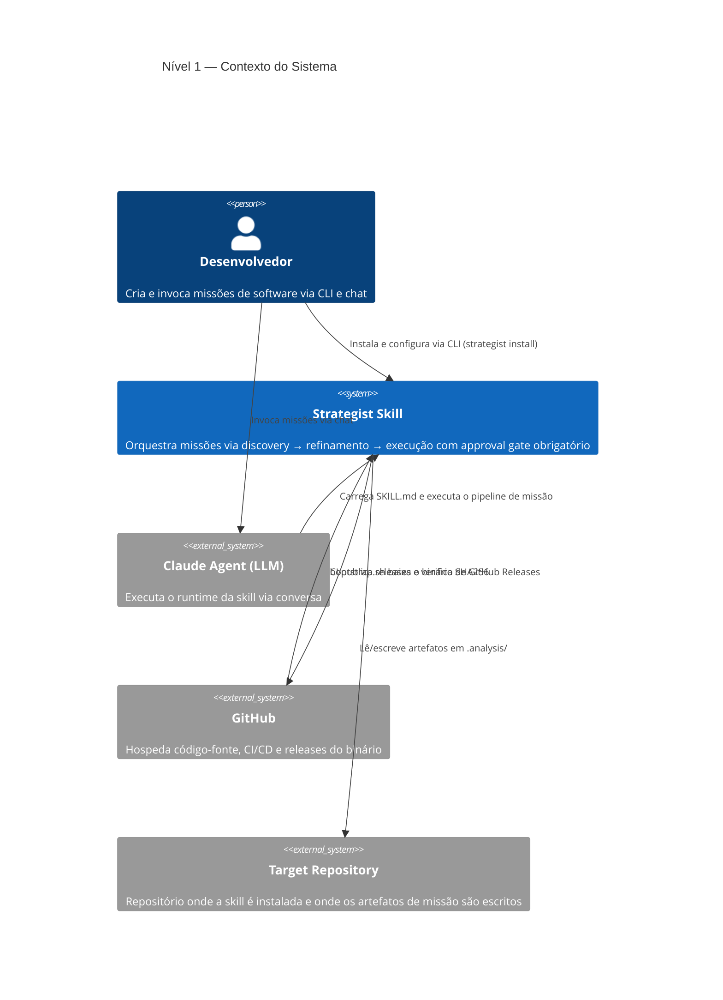
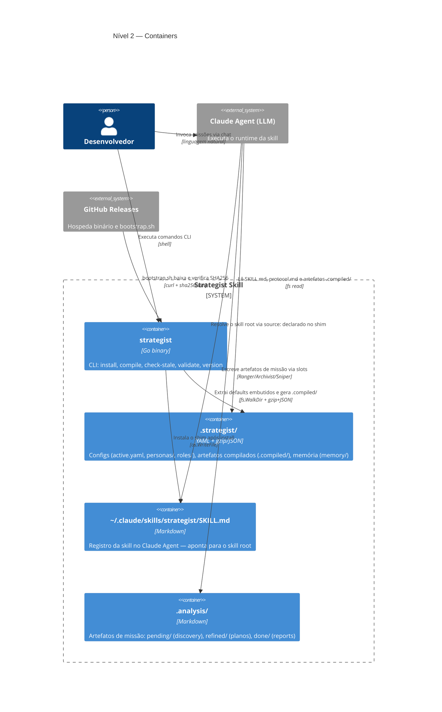
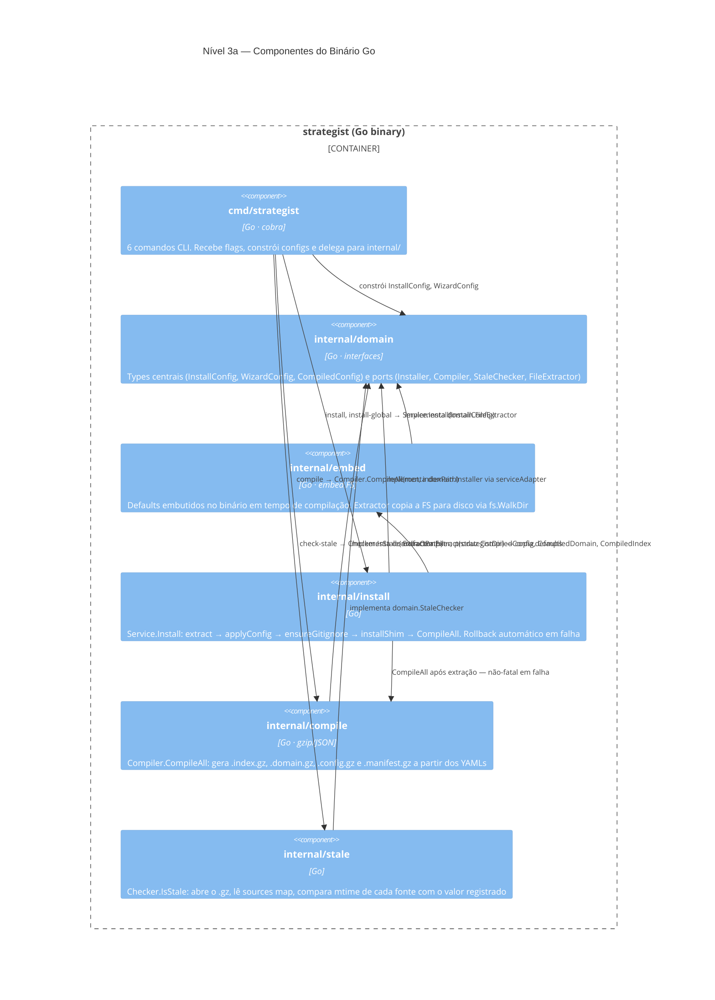
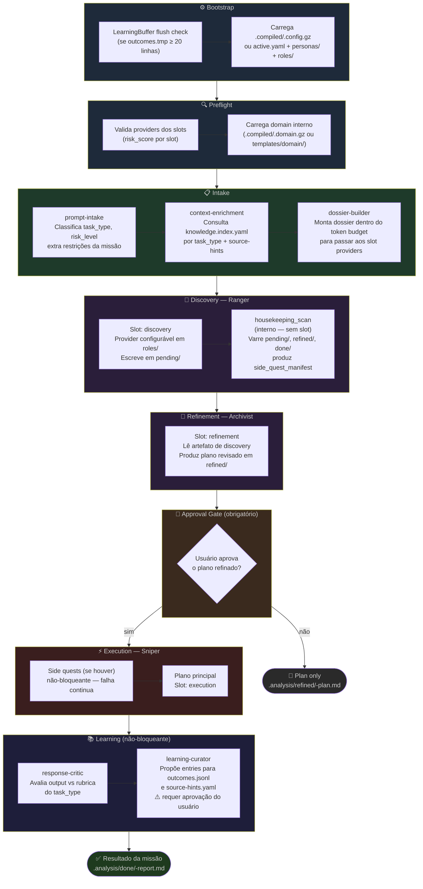

# Diagramas C4 — Strategist Skill

Documentação arquitetural em 4 níveis do modelo C4. Renderizado pelo GitHub via Mermaid.

---

## Nível 1 — Contexto do Sistema

Mostra o Strategist Skill no ecossistema: quem usa o sistema e como ele se relaciona com sistemas externos.

---

## Nível 2 — Containers

Mostra os containers (unidades executáveis e de armazenamento) dentro do sistema Strategist.

---

## Nível 3a — Componentes do Binário Go

Detalha os pacotes internos do binário `strategist` e suas dependências.

---

## Nível 3b — Pipeline do Runtime da Skill

Detalha as fases e sub-skills executadas pelo Claude Agent ao orquestrar uma missão.

---

## Referência rápida — Slots e Sub-skills

| Componente | Tipo | risk_score | Escreve em |
|------------|------|-----------|-----------|
| `prompt-intake` | sub-skill interna | `read_only` | — |
| `context-enrichment` | sub-skill interna | `read_only` | — |
| `dossier-builder` | sub-skill interna | `read_only` | — |
| Slot `discovery` (Ranger) | plugável | `write_pending` | `<base_path>/pending/` |
| `housekeeping_scan` | interno (sem slot) | — | — |
| Slot `refinement` (Archivist) | plugável | `write_analysis` | `<base_path>/refined/` |
| Slot `execution` (Sniper) | plugável | `controlled` | `<base_path>/done/` |
| `response-critic` | sub-skill interna | `read_only` | — |
| `learning-curator` | sub-skill interna | `read_only` | `memory/` (com aprovação) |

---

## Stop Conditions

O pipeline para imediatamente em qualquer destas condições:

| Código | Causa |
|--------|-------|
| `preflight_failed` | Qualquer check de preflight falhou |
| `slot_provider_not_found` | skill.yaml do provider não encontrado |
| `slot_risk_mismatch` | risk_score do provider incorreto para o slot |
| `intake_conflict_unresolved` | Dois aliases mutuamente exclusivos no prompt |
| `user_denies_execution` | Usuário recusou no approval gate (não é erro) |
| `discovery_failed` | Slot discovery não produziu artefato |
| `refinement_failed` | Slot refinement não produziu artefato |
| `slot_write_type_violation` | Slot tentou escrever tipo de arquivo não-`.md` |
| `slot_write_scope_violation` | Slot tentou escrever fora do escopo declarado |
