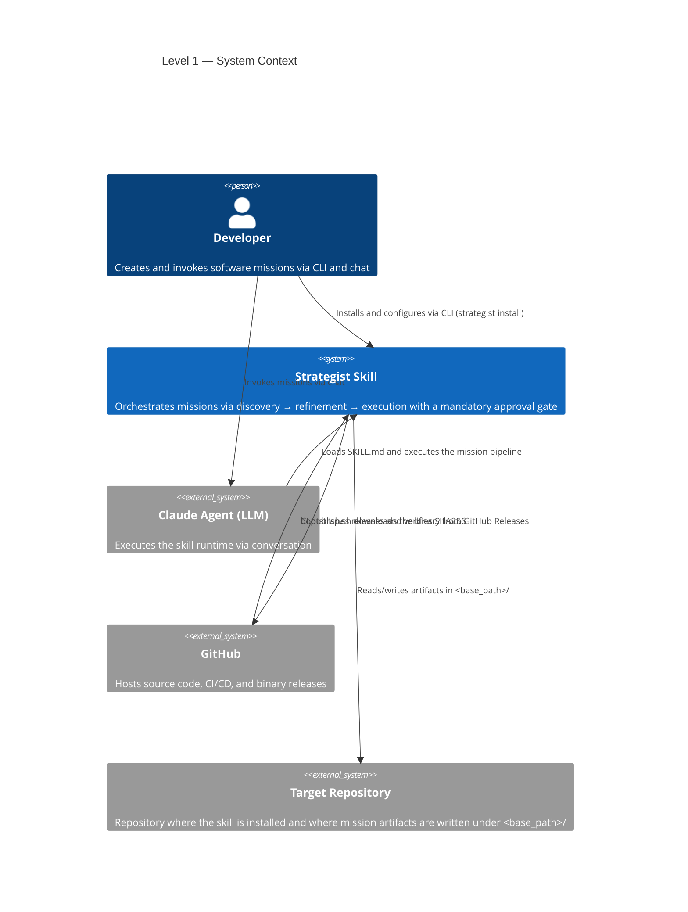
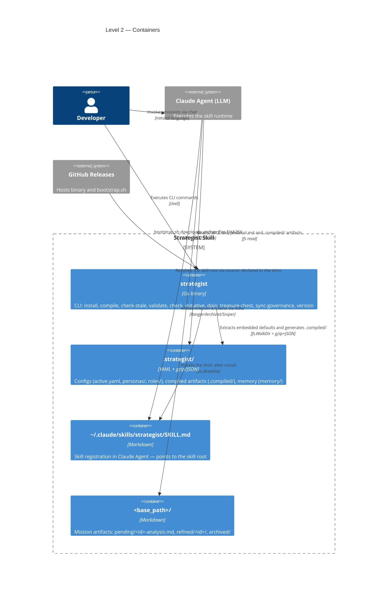
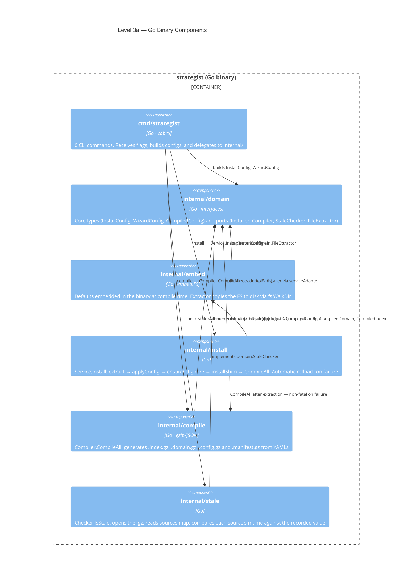
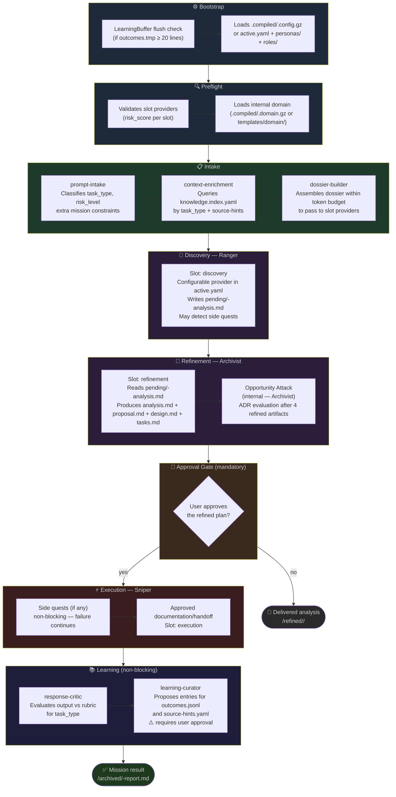
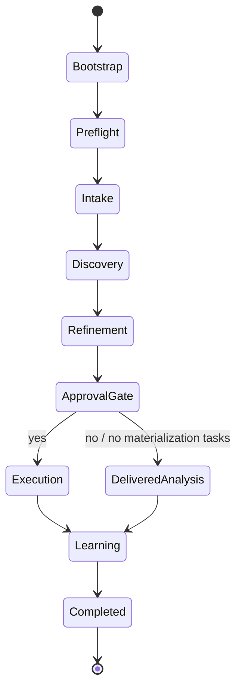

# C4 Diagrams — Strategist Skill

**Status:** Accepted
**Last Updated:** 2026-06-26

Architectural documentation at 4 levels of the C4 model. Rendered by GitHub via Mermaid.

---

## Level 1 — System Context

Shows the Strategist Skill in the ecosystem: who uses the system and how it relates to external systems.

```mermaid
C4Context
    title Level 1 — System Context

    Person(dev, "Developer", "Creates and invokes software missions via CLI and chat")

    System(strategist, "Strategist Skill", "Orchestrates missions via discovery → refinement → execution with a mandatory approval gate")

    System_Ext(claude, "Claude Agent (LLM)", "Executes the skill runtime via conversation")
    System_Ext(github, "GitHub", "Hosts source code, CI/CD, and binary releases")
    System_Ext(target_repo, "Target Repository", "Repository where the skill is installed and where mission artifacts are written under <base_path>/")

    Rel(dev, claude, "Invokes missions via chat")
    Rel(dev, strategist, "Installs and configures via CLI (strategist install)")
    Rel(claude, strategist, "Loads SKILL.md and executes the mission pipeline")
    Rel(strategist, target_repo, "Reads/writes artifacts in <base_path>/")
    Rel(github, strategist, "bootstrap.sh downloads the binary from GitHub Releases")
    Rel(strategist, github, "CI publishes releases and verifies SHA256")
```

---

## Level 2 — Containers

Shows the containers (executable and storage units) within the Strategist system.

```mermaid
C4Container
    title Level 2 — Containers

    Person(dev, "Developer", "")

    System_Boundary(sys, "Strategist Skill") {
        Container(binary, "strategist", "Go binary", "CLI: install, compile, check-stale, validate, check, initiative, dojo, treasure-chest, sync-governance, version")
        Container(skill_root, ".strategist/", "YAML + gzip/JSON", "Configs (active.yaml, personas/, roles/), compiled artifacts (.compiled/), memory (memory/)")
        Container(shim, "~/.claude/skills/strategist/SKILL.md", "Markdown", "Skill registration in Claude Agent — points to the skill root")
        Container(analysis, "<base_path>/", "Markdown", "Mission artifacts: pending/<id>-analysis.md, refined/<id>/, archived/")
    }

    System_Ext(claude, "Claude Agent (LLM)", "Executes the skill runtime")
    System_Ext(github, "GitHub Releases", "Hosts binary and bootstrap.sh")

    Rel(dev, binary, "Executes CLI commands", "shell")
    Rel(dev, claude, "Invokes missions via chat", "natural language")
    Rel(binary, skill_root, "Extracts embedded defaults and generates .compiled/", "fs.WalkDir + gzip+JSON")
    Rel(binary, shim, "Installs the shim after install", "os.WriteFile")
    Rel(claude, shim, "Resolves the skill root via source: declared in the shim")
    Rel(claude, skill_root, "Reads SKILL.md, protocol.md and .compiled/ artifacts", "fs read")
    Rel(claude, analysis, "Writes mission artifacts via slots", "Ranger/Archivist/Sniper")
    Rel(github, binary, "bootstrap.sh downloads and verifies SHA256", "curl + sha256sum")
```

---

## Level 3a — Go Binary Components

Details the internal packages of the `strategist` binary and their dependencies.

```mermaid
C4Component
    title Level 3a — Go Binary Components

    Container_Boundary(bin, "strategist (Go binary)") {
        Component(cmd, "cmd/strategist", "Go · cobra", "6 CLI commands. Receives flags, builds configs, and delegates to internal/")
        Component(domain, "internal/domain", "Go · interfaces", "Core types (InstallConfig, WizardConfig, CompiledConfig) and ports (Installer, Compiler, StaleChecker, FileExtractor)")
        Component(embed_pkg, "internal/embed", "Go · embed.FS", "Defaults embedded in the binary at compile time. Extractor copies the FS to disk via fs.WalkDir")
        Component(install_pkg, "internal/install", "Go", "Service.Install: extract → applyConfig → ensureGitignore → installShim → CompileAll. Automatic rollback on failure")
        Component(compile_pkg, "internal/compile", "Go · gzip/JSON", "Compiler.CompileAll: generates .index.gz, .domain.gz, .config.gz and .manifest.gz from YAMLs")
        Component(stale_pkg, "internal/stale", "Go", "Checker.IsStale: opens the .gz, reads sources map, compares each source's mtime against the recorded value")
    }

    Rel(cmd, install_pkg, "install → Service.Install(InstallConfig)")
    Rel(cmd, compile_pkg, "compile → Compiler.CompileAll(root, indexPath)")
    Rel(cmd, stale_pkg, "check-stale → Checker.IsStale(artifactPath)")
    Rel(cmd, domain, "builds InstallConfig, WizardConfig")
    Rel(install_pkg, embed_pkg, "Extractor.Extract(strategistDir) — copies defaults")
    Rel(install_pkg, compile_pkg, "CompileAll after extraction — non-fatal on failure")
    Rel(install_pkg, domain, "implements domain.Installer via serviceAdapter")
    Rel(compile_pkg, domain, "implements domain.Compiler; produces CompiledConfig, CompiledDomain, CompiledIndex")
    Rel(stale_pkg, domain, "implements domain.StaleChecker")
    Rel(embed_pkg, domain, "implements domain.FileExtractor")
```

---

## Level 3b — Skill Runtime Pipeline

Details the phases and sub-skills executed by the Claude Agent when orchestrating a mission.

```mermaid
flowchart TD
    subgraph bootstrap["⚙️ Bootstrap"]
        B1["LearningBuffer flush check\n(if outcomes.tmp ≥ 20 lines)"]
        B2["Loads .compiled/.config.gz\nor active.yaml + personas/ + roles/"]
        B1 --> B2
    end

    subgraph preflight["🔍 Preflight"]
        P1["Validates slot providers\n(risk_score per slot)"]
        P2["Loads internal domain\n(.compiled/.domain.gz or templates/domain/)"]
        P1 --> P2
    end

    subgraph intake["📋 Intake"]
        I1["prompt-intake\nClassifies task_type, risk_level\nextra mission constraints"]
        I2["context-enrichment\nQueries knowledge.index.yaml\nby task_type + source-hints"]
        I3["dossier-builder\nAssembles dossier within token budget\nto pass to slot providers"]
        I1 --> I2 --> I3
    end

    subgraph discovery["🔭 Discovery — Ranger"]
        D1["Slot: discovery\nConfigurable provider in active.yaml\nWrites pending/<id>-analysis.md\nMay detect side quests"]
    end

    subgraph refinement["📐 Refinement — Archivist"]
        R1["Slot: refinement\nReads pending/<id>-analysis.md\nProduces analysis.md + proposal.md + design.md + tasks.md"]
        R2["Opportunity Attack\n(internal — Archivist)\nADR evaluation after 4 refined artifacts"]
        R1 --> R2
    end

    subgraph gate["🚦 Approval Gate (mandatory)"]
        AG{"User approves\nthe refined plan?"}
    end

    subgraph execution["⚡ Execution — Sniper"]
        E1["Side quests (if any)\nnon-blocking — failure continues"]
        E2["Approved documentation/handoff\nSlot: execution"]
        E1 --> E2
    end

    subgraph learning["📚 Learning (non-blocking)"]
        L1["response-critic\nEvaluates output vs rubric\nfor task_type"]
        L2["learning-curator\nProposes entries for outcomes.jsonl\nand source-hints.yaml\n⚠️ requires user approval"]
        L1 --> L2
    end

    RESULT(["✅ Mission result\n<base_path>/archived/<id>-report.md"])
    NO_EXEC(["📄 Delivered analysis\n<base_path>/refined/<id>/"])

    bootstrap --> preflight --> intake --> discovery --> refinement --> gate
    gate -- "yes" --> execution --> learning --> RESULT
    gate -- "no" --> NO_EXEC

    style bootstrap fill:#1e2a3a,color:#ccc
    style preflight fill:#1e2a3a,color:#ccc
    style intake fill:#1e3a2a,color:#ccc
    style discovery fill:#2a1e3a,color:#ccc
    style refinement fill:#2a1e3a,color:#ccc
    style gate fill:#3a2a1e,color:#ccc
    style execution fill:#3a1e1e,color:#ccc
    style learning fill:#1e1e3a,color:#ccc
    style RESULT fill:#1e3a1e,color:#ccc
    style NO_EXEC fill:#2a2a2a,color:#ccc
```

---

## Quick Reference — Slots and Sub-skills

| Component | Type | risk_score | Writes to |
|-----------|------|-----------|----------|
| `prompt-intake` | internal sub-skill | `read_only` | — |
| `context-enrichment` | internal sub-skill | `read_only` | — |
| `dossier-builder` | internal sub-skill | `read_only` | — |
| Slot `discovery` (Ranger) | pluggable | `write_analysis` | `<base_path>/pending/<mission_id>-analysis.md` |
| `opportunity_attack` | Archivist routine / ADR evaluation | — | — |
| Slot `refinement` (Archivist) | pluggable | `write_analysis` | `<base_path>/refined/` |
| Slot `execution` (Sniper) | pluggable | `controlled` | `<base_path>/archived/` and approved `.md` documentation |
| `response-critic` | internal sub-skill | `read_only` | — |
| `learning-curator` | internal sub-skill | `read_only` | `memory/` (with approval) |

---

## State Diagram — Mission

```mermaid
stateDiagram-v2
    [*] --> Bootstrap
    Bootstrap --> Preflight
    Preflight --> Intake
    Intake --> Discovery
    Discovery --> Refinement
    Refinement --> ApprovalGate
    ApprovalGate --> DeliveredAnalysis: no / no materialization tasks
    ApprovalGate --> Execution: yes
    Execution --> Learning
    DeliveredAnalysis --> Learning
    Learning --> Completed
    Completed --> [*]
```

---

## Stop Conditions

The pipeline stops immediately on any of these conditions:

| Code | Cause |
|------|-------|
| `preflight_failed` | Any preflight check failed |
| `slot_provider_not_found` | Provider skill.yaml not found |
| `slot_risk_mismatch` | Provider risk_score incorrect for the slot |
| `intake_conflict_unresolved` | Two mutually exclusive aliases in the prompt |
| `user_denies_execution` | User declined at the approval gate (not an error) |
| `discovery_failed` | Discovery slot produced no artifact |
| `refinement_failed` | Refinement slot produced no artifact |
| `slot_write_type_violation` | Slot attempted to write a non-`.md` file type |
| `slot_write_scope_violation` | Slot attempted to write outside the declared scope |
