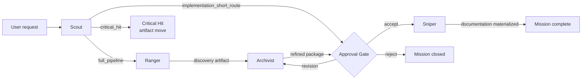

# Light Client Quickstart — Strategist Without the CLI

Strategist's pipeline is already CLI-free once `.strategist/` exists in your workspace: the
Go binary (`strategist install/compile/check/...`) is a setup and validation tool, not a
mission-time dependency. This page explains who does what during a mission, with no CLI
step in the loop, using the same "which question does this answer" framing Hub Centralizado
docs use for their own pipeline.

## Who does what

| Step | Role | Question it answers | CLI involved? |
|---|---|---|---|
| 1 | Scout | *Which route does this request need?* (Critical Hit / Implementation Short Route / Main Mission) | No — built-in classification |
| 2 | Ranger | *What do we know, and what's missing?* | No — native role, reads `.strategist/roles/ranger.yaml` |
| 3 | Archivist | *What's the approved plan?* | No — native role, reads `.strategist/roles/archivist.yaml` |
| 4 | Gate | *Does this plan deserve to be materialized?* | No — a conversational yes/no with the user |
| 5 | Sniper | *Which documents get written?* | No — native role, writes only approved documentation targets |

The CLI's real job happens **before** step 1, and only occasionally:

- `strategist install --wizard` — stamps `.strategist/` into your repo from the embedded template (once, at setup)
- `strategist compile` — regenerates `.strategist/` after you hand-edit `active.yaml` (only when you change config)
- `strategist check` — validates the runtime is well-formed (optional sanity check, not a mission prerequisite)

Everything after `.strategist/` exists — every phase in the table above — runs by an agent
reading Markdown/YAML contracts and using ordinary read/write tools. No phase in this table
invokes the CLI.

## Pipeline flow

## What still needs the CLI

- First-time `.strategist/` setup, unless you copy an existing `.strategist/` folder by hand
  (the runtime instance is a fixed, documented file set — `active.yaml`, `contracts/`,
  `.compiled/`, `roles/`, `personas/` — so a plain copy works too)
- Supply-chain verification of release binaries (`cosign`, `gh attestation`) — irrelevant if
  you're not distributing a compiled binary at all
- `dojo` offline training/eval and `treasurecli` chest CLI mutation — convenience tooling,
  not required for a mission to run

## Related reading

- [`.strategist/skill.yaml`](../../.strategist/skill.yaml) — full pipeline and slot definitions
- [`.strategist/agent-protocol.md`](../../.strategist/agent-protocol.md) — the agent-facing bootstrap contract
- Mission `20260819-portable-light-client-eval` (`.analysis/refined/20260819-portable-light-client-eval/`) — the design analysis this page summarizes
