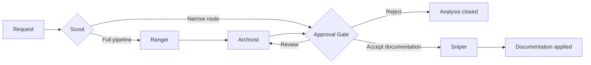

# Strategist — Conceptual Quickstart

Use this page when you want the complete mental model before opening your first mission. It is a navigation layer, not a replacement for the normative runtime contracts.

## The mission in one table

| Phase | Who | Question answered | Primary artifact |
|---|---|---|---|
| Intake and routing | Scout | Which route does this request need? | Route decision |
| Discovery | Ranger | What do we know, what is uncertain, and what is in scope? | `analysis.md` |
| Refinement | Archivist | What should be done, why, and within which boundaries? | `proposal.md`, `design.md`, `tasks.md` |
| Review | You | Is this exact refined package correct? | Explicit gate decision |
| Materialization | Sniper | Which approved documentation targets should be written? | Documentation and completion report |

Strategist analyzes and materializes documentation. Source-code and Git mutation are outside its default contract.

## Lifecycle

The Approval Gate is mandatory on every route. A policy gate may permit execution, but it never substitutes your explicit acceptance.

## Start a mission

1. [Install and configure Strategist](../../QUICKSTART.md).
2. Invoke `/strategist <describe your mission>` from your agent host.
3. Review the refined package under `.analysis/refined/<mission_id>/`.
4. At the Gate, choose `accept`, `review`, or `reject`.
5. Treat implementation handoffs as separate coding work; accepting the Gate does not authorize them.

## Artifact map

| Artifact | Purpose | Format reference |
|---|---|---|
| Discovery analysis | Facts, uncertainties, scope, risks, and refinement focus | [Discovery artifact template](../../internal/embed/defaults/templates/discovery-artifact.md) |
| Proposal | Recommended outcome and prioritization | [Archivist instructions](../../internal/embed/defaults/internal_skills/archivist/SKILL.md) |
| Design | Goals, non-goals, decisions, boundaries, and trade-offs | [Refinement contract](../../internal/embed/defaults/contracts/narrative/04-refinement.md) |
| Tasks | Classified targets, scope, validation, and stop conditions | [Archivist-to-Sniper handoff](../../internal/embed/defaults/schemas/handoff-archivist-to-sniper.schema.yaml) |
| Completion report | What documentation was materialized and what stayed out of scope | [Execution contract](../../internal/embed/defaults/contracts/narrative/06-execution.md) |

Examples are available as completed mission packages under `.analysis/refined/`; runtime templates and contracts live under `internal/embed/defaults/`.

## Choose the next reference

- [Mental model](../mental-model.md) — why the pipeline and Gate exist.
- [Core concepts](../strategist-concepts.md) — routes, roles, providers, abilities, handoffs, and Dojo.
- [Architecture](../architecture.md) — implementation structure and runtime model.
- [Configuration](../configuration.md) — profiles, slots, paths, and languages.
- [CLI reference](../cli-reference.md) — installation, compilation, checks, and maintenance.
- [Generated reference index](../generated/) — always-current contracts, schemas, CLI commands, and telemetry events, regenerated deterministically from source (`make docs-generate`; see [ADR-0025](../adr/0025-generated-documentation-anti-drift.md)).
- [Documentation index](../README.md) — navigate every maintained guide by intent.

## Non-negotiable boundaries

- No phase may silently bypass the Approval Gate.
- A fallback provider must remain visible and governed.
- Only declared documentation targets are materializable by the default Sniper.
- Normative rules belong to runtime contracts; onboarding pages link to them instead of duplicating them.
