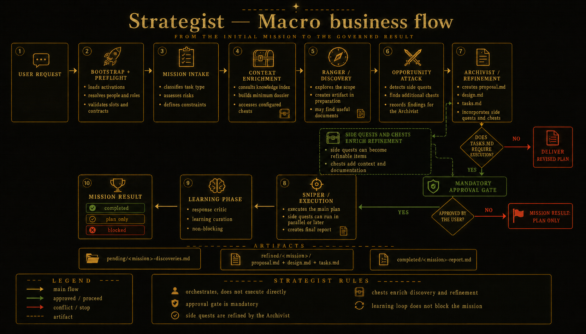

<p align="center">
  
</p>

<div align="center">


**Authors** · Sergio Lacerda &amp; Raphael Vernil

<br/>

<a href="https://sergiolacerda.github.io/strategist-skill/"></a>

<a href="readme.md"></a><a href="README.en.md"></a> &nbsp; <a href="#quick-workflow"></a>

━━━━━━━━━━━━━━━━━━━━ ⟡ ━━━━━━━━━━━━━━━━━━━━

</div>

<p align="center">
  <i>An autonomous skill that <b>orchestrates multi-phase missions</b> through pluggable roles.<br/>
  The Strategist orchestrates the mission, entrusting each step to a specialist and waiting at the <b>approval gate</b>.</i>
</p>

---

# Strategist Skill

## What it is

**Strategist** turns a technical request into a governed documentation mission:
discovery, refinement, and approved documentation/handoff materialization.

Canonical pipeline:
`Ranger → Archivist → approval gate → Sniper`

For full pipeline/contracts/schema details: [readme-detailed-en.md](readme-detailed-en.md).

## Why use it

- Discovery and refinement before execution.
- Mandatory approval gate before Sniper materializes approved documentation or handoff work.
- Pluggable slots (`discovery`, `refinement`, `execution`).
- Mission policy through `mission_mode` (analysis vs delivery).
- Quick Draw, Opportunity Attack, Side Quests, Critical Hit, and Treasure Chests in the same flow.

## How it works

- **Scout** (internal, pre-pipeline): classifies the request and picks the route before any slot runs. Does not perform discovery itself.
- **Ranger**: explores context and produces discovery.
- **Archivist**: turns discovery into proposal, design, and tasks.
- **Sniper**: materializes approved documentation/handoff work only after gate + policy checks.
- **Opportunity Attack**: Archivist-owned ADR evaluation after all four refined artifacts are written.
- **Side Quests**: cross-phase scope observations; Archivist consolidates and presents at the approval gate; Sniper reports newly discovered ones.
- **Critical Hit**: analysis `.md` movement route within `<base_path>` folders (`pending/`, `refined/`, `archived/`).
- **Treasure Chests**: offline scoped context sources. `strategist treasure-chest index`/`mine` currently manage jewels (compact source-linked knowledge points, `proposed → accepted/verified/deprecated`); jewel runtime consultation and Scout telemetry are documented as target behavior — see `docs/observability-contract.md`.

## Generated files

| Path | Purpose |
|---|---|
| `.strategist/active.yaml` | mode, language, slots, mission policy |
| `.strategist/knowledge.index.yaml` | sources by `task_type` |
| `.analysis/` | `pending`, `refined`, `archived` artifacts |

## Minimal slot configuration

```yaml
slots:
  discovery: brainstorming
  refinement: openspec-explore
  execution: sniper
```

Expected contracts:
- Ranger: `write_analysis`
- Archivist: `write_analysis`
- Sniper: `controlled`

## General Flow


## SDD Integration Flow



## Explore more

- [readme-detailed-en.md](readme-detailed-en.md)
- [configuration.md](../configuration.md)
- [cli-reference.md](../cli-reference.md)
- [architecture.md](../architecture.md)
- [skill-internals.md](../skill-internals.md)
- [c4-diagrams.md](../c4-diagrams.md)
- [adr/](../adr/)
- [strategist/SKILL.md](../../strategist/SKILL.md)
- [strategist/protocol.md](../../strategist/protocol.md)

## Development and tests

- `make build` — compiles the local binary into `bin/strategist`
- `make test-lite` — runs the isolated test slices that do not download new dependencies
- `make test` — runs unit and package tests
- `make integration` — runs E2E/integration tests with `-tags=integration`
- `make test-all` — runs `test` + `integration`
- `make bench` — runs benchmarks
- `make cover` — generates per-package coverage
- `make cover-gate` — fails if any internal package is below 90% coverage
- `make cover-html` — generates a consolidated `coverage.html` report
- When contributing external skills used as wizard default providers, preserve attribution to the upstream project and include an installable canonical manifest at `.strategist/skills/<provider>/skill.yaml`.

```bash
make build
make test-lite
make test
make integration
make test-all
make bench
make cover
make cover-gate
make cover-html
```

### Role in the flow

- `brainstorming` is referenced as the basis for structured exploration in the `Ranger` role, including option discovery, risks, trade-offs, and early clarification.
- `openspec` is referenced as the basis for convergent formalization in the `Archivist` role, including change proposal, design, tasks, and acceptance criteria.
- When installed as wizard default providers, these skills remain independent; `strategist` only orchestrates their use inside the pipeline.
