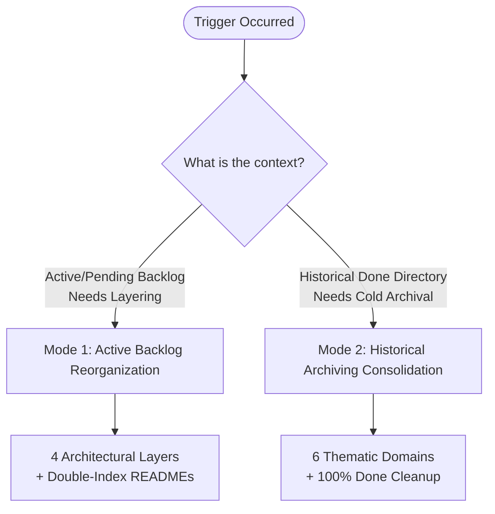

# Operational Runbook: Demands and Documentation Reorganization

## 1. Executive Summary & Purpose

This runbook establishes the canonical, automated, and zero-data-loss protocol for AI agents (Ranger, Archivist, Sniper, subagents) and engineers to reorganize, categorize, index, and archive technical documentation packages, analysis missions, and historical reports within the Strategist workspace.

Whenever a backlog of analyses or completed missions accumulates, agents must not guess or perform ad-hoc file moves. Instead, they must follow this deterministic procedure to ensure architectural clarity, full traceability, double indexing, and mathematical verification of completeness.

---

## 2. Non-Negotiable Guardrails

1. **Zero Data Loss Invariant (Hard Gate)**:  
   $$\text{Total Items in Source} = \sum \text{Items in Target Domains}$$
   The migration is never considered valid until this equation evaluates to `true`.
2. **Package Atomicity**:  
   Folders representing multi-file analysis missions (containing `analysis.md`, `proposal.md`, `tasks.md`, `design.md`, etc.) must be moved as indivisible directory units. Never flatten or dissect an active mission folder during reorganization.
3. **No Autonomous Git State Modification (Mandate M010)**:  
   Agents must NEVER run `git commit`, `git add`, `git push`, or `git reset` autonomously.
4. **English Documentation Standard (Mandate M011)**:  
   All generated runbooks, indexes, and documentation headers must strictly follow English as the primary technical language.

---

## 3. Operational Modes & Triggers

Agents should select one of the following two modes depending on the operational trigger:



### Mode 1: Active Backlog Reorganization (Layered Structure)
- **Trigger**: When `.analysis/pending/` or a specialized subsystem folder contains multiple related pending analysis missions that need structured refinement and sequential implementation planning.
- **Output Model**: 4 Architectural Layers + Double-Indexing (`README.md` at root + `README.md` per layer).

### Mode 2: Historical Archiving Consolidation (Thematic Cold Storage)
- **Trigger**: When `.analysis/done/` accumulates >20 completed missions/reports and requires clean-up to prevent workspace clutter while preserving cold history.
- **Output Model**: 6 Thematic Domains in `.analysis/archived/` + clean `.analysis/done/` ready for active cycles.
- **Precondition — verify closure before archiving**: "100% Done Cleanup" assumes every item already sitting in `.analysis/done/` reached a real Critical Hit closure (`11-critical-hit.md`). That is not always true — a package can end up in `done/` without one. Before classifying-and-moving, check each item's `mission_status` (canonical values: `.strategist/contracts/machine/mission-status.yaml`):
  - `documentation_applied`, or `archivist_done`/`gate_analysis_accepted` with an empty/no `tasks.md` documentation-target list → genuinely terminal, safe to archive.
  - Any other single status with open documentation targets, or `gate_pending` → not actually done; route back to `.analysis/refined/<id>/` instead of archiving it as history.
  - A directory carrying more than one distinct `mission_status` internally is a mixed aggregate, not one atomic package — leave it for its own decomposition pass rather than moving or dissecting it.
  This precondition was learned the hard way: missions `20260917-reorganizar-done-archived` and `20260923-reorganizar-done-archived` both archived only clearly-terminal items and left the rest as unclassified residuals; `20260923-reorg-residuals-audit` then found several of those residuals were themselves misclassified (empty-task terminal packages) or genuinely misplaced (open work parked in `done/`), and corrected them — see that mission's `manifest.md` for the worked example.

---

## 4. Canonical Taxonomies & Heuristic Reference

### Taxonomy A: Active Architectural Layers (Mode 1)

| Layer Directory | Architectural Domain | Scope & Focus |
| :--- | :--- | :--- |
| `01-core-semantics-contracts` | Core Contracts & Roles | Canonical Role/Provider/Binding definitions, sovereign role limits, capability models, and compliance checks. |
| `02-external-skills-adapters` | External Skills & Adapters | Upstream skill provenance, adapter patterns, package digest pinning, and trust policies. |
| `03-lifecycle-persistence-runtime` | Lifecycle Engine & Lock | In-memory binding resolution, `plugins.lock` persistence, transactional activation, and runtime state. |
| `04-wizard-cli-surface` | User Interface & CLI Tools | `strategist install` Wizard UX, option filtering, fallback maps, and `strategist check` CLI output. |

### Taxonomy B: Thematic Historical Domains (Mode 2)

| Target Domain | Target Directory | Matching Keywords / Semantics |
| :--- | :--- | :--- |
| **01 Governance & Docs** | `01-governance-guardrails-docs` | `governance`, `guardrail`, `standardization`, `docs`, `language`, `bilingual`, `english`, `i18n`, `license`, `token-economy`, `adr`, `drift`, `contracts`, `_legacy`, `critique`, `aprovacoes` |
| **02 Core Runtime & Roles**| `02-core-runtime-pipeline` | `runtime`, `pipeline`, `role-`, `role_`, `ranger`, `archivist`, `sniper`, `hunter`, `critical-hit`, `persona`, `epic-output`, `initiative`, `bigbang`, `go-migration`, `go-governance`, `riposte`, `domain-module`, `flow-gap`, `conflito` |
| **03 Skills & Plugins** | `03-skills-plugins-providers` | `skill`, `skills`, `provider`, `weapon`, `abilities`, `_SKILLS`, `comparacao_skill`, `criqtique_skill`, `opt-strategist`, `custom`, `shim-embed`, `taxonomy`, `embed-skills` |
| **04 Treasure Chest & Dojo**| `04-treasure-chest-dojo` | `treasure`, `bau-tesouro`, `jewel`, `jewels`, `dojo`, `runbook`, `runbooks`, `side-quest`, `sq-`, `sq0`, `potions`, `scout` |
| **05 CI/CD & Telemetry** | `05-ci-cd-tests-telemetry` | `ci`, `cd`, `cicd`, `test`, `tests`, `testing`, `testes`, `make`, `makefile`, `coverage`, `telemetry`, `otel`, `codeql`, `promptfoo`, `goreleaser`, `release`, `benchmark`, `performance`, `_DEVOPS`, `supply-chain` |
| **06 Landing Site & UX** | `06-landing-site-console-ux` | `landing`, `site`, `_SITE`, `console`, `wizard`, `tui`, `github-pages`, `site.txt` |

---

## 5. Step-by-Step Agent Execution Protocol

### Step 1: Pre-Flight Discovery & Invariant Baseline
1. Scan the source directory (`os.listdir(source_dir)`).
2. Count all directory items and standalone files ($N_{\text{total}}$).
3. Identify multi-file packages vs. standalone reports (`.md`, `.txt`, `.svg`).

### Step 2: Target Scaffolding
1. Create the target parent directory if not present (`mkdir -p <target_base>`).
2. Scaffold all domain subdirectories.

### Step 3: Deterministic Migration Execution
1. Run the parameterized Python classification script (see Section 6).
2. The script evaluates items against priority rules and moves each item atomically via `shutil.move`.
3. The script evaluates the invariant:
   $$\sum_{d \in \text{Domains}} \text{Count}(d) == N_{\text{total}}$$

### Step 4: Double-Indexing Documentation (For Mode 1)
When reorganizing an active backlog, generate double indexes:
1. **Root `README.md`**: Contains overview, Mermaid dependency flow, and master status table.
2. **Layer `README.md`** (in each subfolder): Contains domain boundaries, included packages with links, critical gaps, and next action items.

### Step 5: Verification & Cleanup Gate
1. Confirm that the source directory is completely empty or cleanly removed.
2. Verify that internal package files (`analysis.md`, `proposal.md`, `tasks.md`, `design.md`) are present and intact.
3. Check relative Markdown links in generated indexes.

---

## 6. Reusable Automation Script Template

Agents should write and execute this script in their scratch directory to perform large-scale, safe classification:

```python
#!/usr/bin/env python3
"""
Canonical Reorganization and Archival Migration Script
Guarantees atomic moves and strict mathematical count verification.
"""
import os
import shutil
import sys

SOURCE_DIR = "/home/sergio/dev/strategist-skill/.analysis/done"
TARGET_BASE = "/home/sergio/dev/strategist-skill/.analysis/archived"

# Mode 2 Thematic Dictionary
DOMAINS = {
    "01-governance-guardrails-docs": [
        "governance", "guardrail", "guardrails", "standardization", "docs", "language", 
        "bilingual", "english", "i18n", "license", "token-economy", "token_economy", "adr", 
        "drift", "contracts", "_legacy", "rbac", "audit-log", "criticas_projeto", 
        "critique_archtecture", "critique_strategist", "critiques", "aprovacoes",
        "sync-explanation", "nomenclature", "editorial", "review_readme", "readme_header"
    ],
    "02-core-runtime-pipeline": [
        "runtime", "pipeline", "role-", "role_", "role-standardization", "role_weapon",
        "ranger", "archivist", "sniper", "hunter", "critical-hit", "persona", "epic-output", 
        "initiative", "bigbang", "go-migration", "go-governance", "riposte", "domain-module", 
        "flow-gap", "conflito_multi_thread", "falha_strategist", "pre-refactoring", "batch-analysis",
        "meta-pertinencia", "recovery-patterns", "project-analysis", "segmentacao-analise",
        "eval-wizard-awareness", "endurance-audit", "perf-review", "scope-simplification"
    ],
    "03-skills-plugins-providers": [
        "skill", "skills", "provider", "weapon", "abilities", "_SKILLS", "comparacao_skill", 
        "criqtique_skill", "opt-strategist", "custom", "shim-embed", "ai-first", "v3",
        "taxonomy", "embed-skills"
    ],
    "04-treasure-chest-dojo": [
        "treasure", "bau-tesouro", "jewel", "jewels", "dojo", "runbook", "runbooks", 
        "side-quest", "sq-", "sq0", "potions", "scout", "scaffolding"
    ],
    "05-ci-cd-tests-telemetry": [
        "ci", "cd", "cicd", "test", "tests", "testing", "testes", "make", "makefile", 
        "coverage", "telemetry", "otel", "codeql", "promptfoo", "goreleaser", "release", 
        "benchmark", "benchmarks", "performance", "perf-opt", "otimizacao", "peformance",
        "_DEVOPS", "supply-chain", "cosign", "go-test", "pin-actions", "impl-audit",
        "security-audit", "file-size-report"
    ],
    "06-landing-site-console-ux": [
        "landing", "site", "_SITE", "console", "wizard", "tui", "github-pages", "site.txt", "site_2.txt"
    ]
}

def classify_item(name: str) -> str:
    low = name.lower()
    
    # Priority Overrides
    if any(k in low for k in ["treasure", "bau-tesouro", "jewel", "dojo", "runbook", "sq0", "sq-", "potions", "scout"]):
        return "04-treasure-chest-dojo"
    if any(k in low for k in ["landing", "_site", "github-pages", "console-ux", "console_ux", "tui-wizard"]):
        return "06-landing-site-console-ux"
    if any(k in low for k in ["ci-cd", "cicd", "goreleaser", "makefile", "make-", "promptfoo", "otel", "telemetry", "codeql", "coverage", "testes-e2e", "test-framework", "testing", "testes", "tests", "perf-opt", "peformance", "benchmarks", "_devops"]):
        return "05-ci-cd-tests-telemetry"
    if any(k in low for k in ["wizard", "site.txt", "site_2.txt"]):
        return "06-landing-site-console-ux"
    if any(k in low for k in ["skill", "provider", "weapon", "abilities", "_skills", "custom", "shim-embed"]):
        return "03-skills-plugins-providers"
    if any(k in low for k in ["runtime", "pipeline", "role", "ranger", "archivist", "sniper", "hunter", "critical-hit", "persona", "epic-output", "bigbang", "riposte", "domain-module", "conflito", "falha_strategist"]):
        return "02-core-runtime-pipeline"
    if any(k in low for k in ["governance", "guardrail", "standardization", "docs", "language", "bilingual", "english", "i18n", "license", "token-economy", "token_economy", "adr", "drift", "contracts", "_legacy", "critique"]):
        return "01-governance-guardrails-docs"
        
    for domain, keywords in DOMAINS.items():
        if any(kw in low for kw in keywords):
            return domain
            
    return "01-governance-guardrails-docs"

def main():
    if not os.path.exists(SOURCE_DIR):
        print(f"Error: Source directory {SOURCE_DIR} does not exist.")
        sys.exit(1)
        
    items = sorted(os.listdir(SOURCE_DIR))
    total_source = len(items)
    print(f"[*] Initial scan: {total_source} items found in {SOURCE_DIR}")
    
    for domain in DOMAINS.keys():
        os.makedirs(os.path.join(TARGET_BASE, domain), exist_ok=True)
        
    counts = {d: 0 for d in DOMAINS.keys()}
    
    for item in items:
        domain = classify_item(item)
        src_path = os.path.join(SOURCE_DIR, item)
        dst_path = os.path.join(TARGET_BASE, domain, item)
        
        shutil.move(src_path, dst_path)
        counts[domain] += 1
        
    print("\n[*] Migration Summary:")
    total_migrated = 0
    for domain, count in counts.items():
        print(f"    - {domain}: {count} items")
        total_migrated += count
        
    # Invariant Verification
    print(f"\n[*] Verification:")
    print(f"    Total Expected : {total_source}")
    print(f"    Total Migrated : {total_migrated}")
    
    if total_source != total_migrated:
        print("[!] ERROR: Mathematical invariant failed! Data loss detected.")
        sys.exit(1)
        
    remaining = len(os.listdir(SOURCE_DIR))
    print(f"    Remaining in Source: {remaining}")
    if remaining == 0:
        print("[+] SUCCESS: All items safely migrated with 100% integrity.")
    else:
        print(f"[!] WARNING: {remaining} items remain in source directory.")

if __name__ == "__main__":
    main()
```

---

## 7. Double-Indexing Documentation Pattern

For Mode 1 reorganizations, agents must generate the following standard index documents:

### Root Index Template (`skills_plugaveis_review/README.md`)

```markdown
# Pluggable Skills and Plugins Review — Master Index

## 🏛️ Layer Dependency Flow
\`\`\`mermaid
flowchart TD
    C01["01 - Core Semantics & Contracts"]
    C02["02 - External Skills & Adapters"]
    C03["03 - Lifecycle Persistence & Runtime"]
    C04["04 - Wizard & CLI Surface"]
    C01 --> C02
    C01 --> C03
    C02 --> C03
    C03 --> C04
\`\`\`

## 📋 Master Demand Matrix
| Layer | Mission / Package | Status | Primary Scope |
| :--- | :--- | :--- | :--- |
| **01 Core** | [\`mission-name\`](./01-core/.../proposal.md) | \`status\` | Description |
```

### Layer Index Template (`01-core-.../README.md`)

```markdown
# Layer 01: Core Semantics and Contracts

## 📦 Included Packages
### 1. [\`mission-name\`](./mission-name/proposal.md)
- **Objective**: Summary
- **Status**: Status

## 🔑 Architectural Decisions & Constraints
- Key decision 1
- Key decision 2
```

---

## 8. Verification & Exit Checklist

Before concluding any reorganization task, the agent must check:

- [ ] Mathematical invariant verified: $\text{Total Source} == \text{Total Target}$.
- [ ] Source directory is either clean or removed.
- [ ] Multi-file packages retain all internal files (`analysis.md`, `proposal.md`, `tasks.md`, `design.md`).
- [ ] Double-indexing `README.md` files generated with valid relative links (for Mode 1).
- [ ] No git state-modifying commands were executed (M010 compliance).
- [ ] Walkthrough artifact created/updated for user review.
