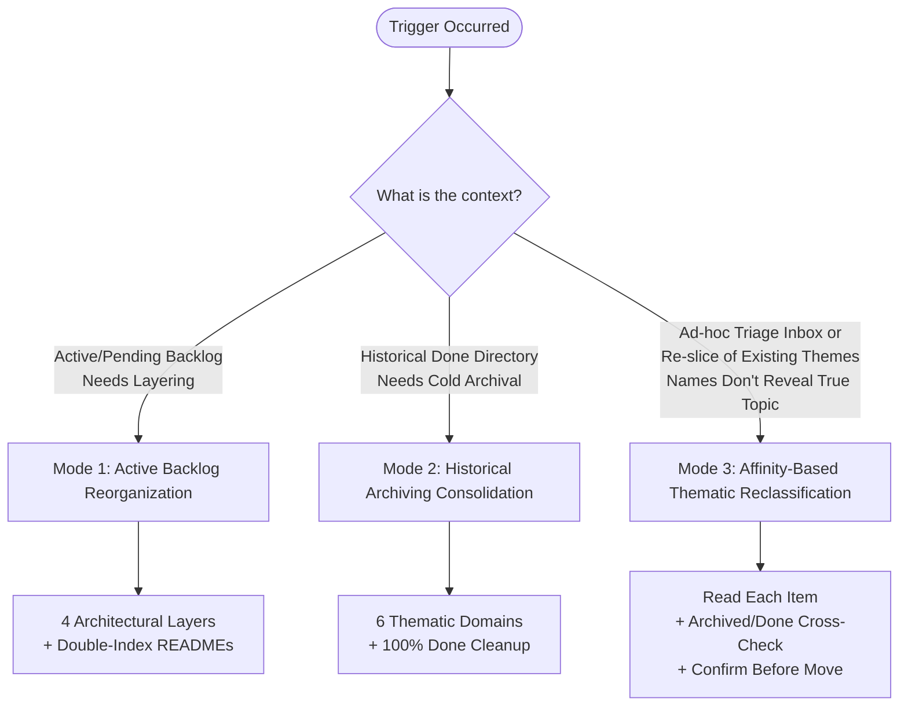

# Operational Runbook: Demands and Documentation Reorganization

## 1. Executive Summary & Purpose

This runbook establishes the canonical, automated, and zero-data-loss protocol for AI agents (Ranger, Archivist, Sniper, subagents) and engineers to reorganize, categorize, index, and archive technical documentation packages, analysis missions, and historical reports within the Strategist workspace.

Whenever a backlog of analyses or completed missions accumulates, agents must not guess or perform ad-hoc file moves. Instead, they must follow this deterministic procedure to ensure architectural clarity, full traceability, double indexing, and mathematical verification of completeness.

Two modes (below) classify by matching item **names** against a fixed keyword taxonomy — fast,
but wrong whenever names collide across unrelated topics or an ad-hoc triage inbox can't be
judged by name at all. **2026-09-28**: added Mode 3 for that case — affinity decided by reading
each item's actual content, with a mandatory archived/done cross-check before any discard, and
explicit user confirmation of the proposed mapping before executing it.

---

## 2. Non-Negotiable Guardrails

1. **Zero Data Loss Invariant (Hard Gate)**:  
   $$\text{Total Items in Source} = \sum \text{Items in Target Domains}$$
   The migration is never considered valid until this equation evaluates to `true`.
2. **Package Atomicity**:  
   Folders representing multi-file analysis missions (containing `analysis.md`, `proposal.md`, `tasks.md`, `design.md`, etc.) must be moved as indivisible directory units. Never flatten or dissect an active mission folder during reorganization.
3. **No Autonomous Git State Modification (Mandate M010)**:  
   Agents must NEVER run `git commit`, `git add`, `git push`, or `git reset` autonomously.
4. **English Documentation Standard (Mandate M011)**:  
   All generated runbooks, indexes, and documentation headers must strictly follow English as the primary technical language.

---

## 3. Operational Modes & Triggers

Agents should select one of the following three modes depending on the operational trigger:


```mermaid
flowchart TD
    Trigger([Trigger Occurred]) --> CheckType{What is the context?}
    CheckType -->|Active/Pending Backlog\nNeeds Layering| Mode1[Mode 1: Active Backlog Reorganization]
    CheckType -->|Historical Done Directory\nNeeds Cold Archival| Mode2[Mode 2: Historical Archiving Consolidation]
    CheckType -->|Ad-hoc Triage Inbox or\nRe-slice of Existing Themes\nNames Don't Reveal True Topic| Mode3[Mode 3: Affinity-Based Thematic Reclassification]

    Mode1 --> LayerTaxonomy[4 Architectural Layers\n+ Double-Index READMEs]
    Mode2 --> DomainTaxonomy[6 Thematic Domains\n+ 100% Done Cleanup]
    Mode3 --> ContentRead[Read Each Item\n+ Archived/Done Cross-Check\n+ Confirm Before Move]
```

### Mode 1: Active Backlog Reorganization (Layered Structure)
- **Trigger**: When `.analysis/pending/` or a specialized subsystem folder contains multiple related pending analysis missions that need structured refinement and sequential implementation planning.
- **Output Model**: 4 Architectural Layers + Double-Indexing (`README.md` at root + `README.md` per layer).

### Mode 2: Historical Archiving Consolidation (Thematic Cold Storage)
- **Trigger**: When `.analysis/done/` accumulates >20 completed missions/reports and requires clean-up to prevent workspace clutter while preserving cold history.
- **Output Model**: 6 Thematic Domains in `.analysis/archived/` + clean `.analysis/done/` ready for active cycles.
- **Precondition — verify closure before archiving**: "100% Done Cleanup" assumes every item already sitting in `.analysis/done/` reached a real Critical Hit closure (`11-critical-hit.md`). That is not always true — a package can end up in `done/` without one. Before classifying-and-moving, check each item's `mission_status` (canonical values: `.strategist/contracts/machine/mission-status.yaml`):
  - `documentation_applied`, or `archivist_done`/`gate_analysis_accepted` with an empty/no `tasks.md` documentation-target list → genuinely terminal, safe to archive.
  - Any other single status with open documentation targets, or `gate_pending` → not actually done; route back to `.analysis/refined/<id>/` instead of archiving it as history.
  - A directory carrying more than one distinct `mission_status` internally is a mixed aggregate, not one atomic package — leave it for its own decomposition pass rather than moving or dissecting it.
  This precondition was learned the hard way: missions `20260917-reorganizar-done-archived` and `20260923-reorganizar-done-archived` both archived only clearly-terminal items and left the rest as unclassified residuals; `20260923-reorg-residuals-audit` then found several of those residuals were themselves misclassified (empty-task terminal packages) or genuinely misplaced (open work parked in `done/`), and corrected them — see that mission's `manifest.md` for the worked example.

### Mode 3: Affinity-Based Thematic Reclassification (Content-Read, Not Keyword-Match)

Added 2026-09-28, from a worked multi-pass reorganization of `.analysis/pending/avaliar/`
and `.analysis/pending/v2/` into `.analysis/pending/revisado/`. Modes 1 and 2 both classify by
matching directory/file **names** against a fixed keyword dictionary (Taxonomy A/B below); that
is fast but wrong whenever names collide across unrelated topics (two folders both called
"compatibility" that turn out to mean entirely different things) or when a folder's real content
cannot be judged from its name at all (a triage inbox accumulated ad hoc, e.g. `avaliar/`,
literally "to evaluate"). Mode 3 is for exactly that case: affinity is decided by **reading**
each item, not by matching its name.

- **Trigger**: A staging/triage folder mixes unrelated missions/notes accumulated ad hoc and a
  keyword-driven classification (Taxonomy A/B) would be too coarse or provably wrong. Also
  applies when re-slicing an **already** content-classified set of theme folders into a
  different, coarser, or orthogonal taxonomy later (e.g., regrouping 13 topic folders into a
  2-way bugs/melhorias split in a follow-up request) — treat the previously organized tree as the
  new source and re-run this same procedure; a folder is never "final" just because it was
  reorganized once.

- **Output model**: theme folders named after actual subject matter, decided per item, not a
  fixed layer/domain list — there is no Taxonomy C to reuse verbatim across missions, only this
  procedure.

#### Step-by-step

1. **Full inventory first, always.** `find <source> -type f | sort` before proposing anything.
   Directory names lie; a folder can hide a multi-file mission package, a nested `.amendments/`
   revision, or a file whose topic has nothing to do with its parent folder's name.
2. **Delegate the bulk read when the inbox is large** (rule of thumb: more than ~15 files or
   several unread subfolders). Hand a subagent (Explore/general-purpose) the exhaustive path
   list from step 1 and ask for: proposed theme buckets with one-sentence descriptions; a
   per-file/per-folder classification with a one-line status note; explicit duplicate/
   supersession pairs; and anything whose `mission_status` already reads
   `archivist_done`/`gate_analysis_accepted`/`documentation_applied` or similar (a candidate for
   the archived/done cross-check in the next step, not raw triage material). This keeps 80+ file
   reads out of the parent agent's own context.
3. **Archived/done cross-check before discarding anything** — mandatory, not optional, for every
   item the previous step flagged as "already advanced":
   - `grep`/`find` `.analysis/archived/` and `.analysis/done/` for the item's exact `mission_id`.
   - A **full package folder** match (same `mission_id`, same `analysis.md`/`proposal.md`/etc.
     shape) under `done/`/`archived/` → the pending copy is a stale duplicate; safe to discard.
   - Only a **completion report/ADR** match (`<mission_id>-report.md`, `-adr.md`, no full package
     folder) → still discard the pending copy, but only once the report's own status reads
     genuinely terminal (`documentation_applied` and/or an ADR exists) — the report is the
     durable record from here on, the loose pending copy is not.
   - A `done/` package whose own completion report lists the **pending file itself** under
     "Materialized targets" → that is an in-place edit, not a copy. The pending file stays
     current and authoritative; read the report before assuming a same-named `done/` package means
     the pending item is closed.
   - No match at all → keep, migrate normally. Never delete or skip an item on a name-similarity
     hunch alone — every discard needs a cited archived/done path as evidence.
4. **Propose before moving.** Present the theme table (source → destination, one row per item or
   per folder) and get an explicit go/no-go, especially before any step that discards content.
   Reading and classifying is cheap to redo; an executed `rm -rf` is not.
5. **Execute with `command`-prefixed shell built-ins**: `command mkdir -p`, `command mv`,
   `command rm -rf` / `command rmdir` — in an interactive shell these can be aliased to
   confirmation-prompting variants that hang a non-interactive session; the bare `cp`/`mv`/`rm`
   spelling is not reliable here.
6. **Split mixed-content folders instead of forcing a whole-folder move.** If a folder holds
   items of genuinely different affinity under the requested taxonomy (one file is a confirmed
   defect, its neighbor is a proposed improvement idea), move the individual files to their
   respective destinations and say so explicitly in the report — do not silently keep the folder
   intact just because most of its contents lean one way.
7. **Never `mv` two source files with the same basename into the same flat destination
   directory without renaming.** `mv file dest/` silently overwrites `dest/file` if it already
   exists — no error, no prompt, even under `command mv` (bypassing the interactive alias removes
   exactly the protection that might have caught this). This is a real incident, not a
   hypothetical: a 2026-09-29 `.analysis/done/` → `.analysis/archived/` pass moved six
   differently-sourced `README.md`/`ROADMAP.md`-named files into the same taxonomy-domain folder
   across two separate `mv` batches; each later move silently destroyed the previous file's
   content, and the loss was only caught by the zero-data-loss invariant in step 8 undershooting
   by exactly 6 — by then the original content was gone (no git history, since `.analysis/` is
   gitignored). Before executing any batch of moves, run
   `find <sources...> -maxdepth <depth> -type f -printf '%f\n' | sort | uniq -d` across everything
   feeding into one destination folder; any name it prints must be resolved (rename with a
   distinguishing prefix drawn from its parent path, e.g. `drift-README.md` vs
   `cli-refactor-README.md`, or nest it under a subfolder instead of flattening) before the move
   runs, not after.
8. **Zero Data Loss invariant, same equation as Mode 1/2**: `find <source> -type f | wc -l`
   before must equal the sum of `find <targets> -type f | wc -l` after, plus the count of any
   items explicitly discarded in step 3 (list them by path, not just by count). If the equation is
   short and step 7's collision check was skipped or incomplete, suspect an overwrite collision
   before anything else — it is the most common cause of an otherwise-clean-looking shortfall.
9. **Remove the emptied source tree** (`command rmdir`, deepest directories first) once the
   invariant holds — an empty `avaliar/compatibility/` left behind after every file moved out is
   noise, not history.
10. **Relative-link repair pass** — broader than Mode 1's "check links in generated indexes,"
    because Mode 3 also moves **pre-existing** files whose own links were written for their old
    depth: `grep -rnoE "\]\([^)]+\.md[^)]*\)" <target-tree>` over the moved tree (excluding plain
    `https?://` links) to enumerate every surviving relative Markdown link, then check each one
    still resolves from the file's *new* location. A link written as `../README.md` silently rots
    the moment its file gains extra nesting depth. Do not guess a plausible destination — trace the
    original target through repo evidence (a sibling README's own indexing convention, an evidence
    citation elsewhere naming the old path, `git log --follow` if the file happens to be tracked)
    before rewriting the link. When a taxonomy split (e.g. bugs-drifts vs. regular) breaks up a
    file's own previously-stated "these items are kept together" design intent, say so explicitly
    in the repaired file rather than quietly re-pointing the links as if nothing changed.

---

## 4. Canonical Taxonomies & Heuristic Reference

Taxonomies A and B below are fixed keyword dictionaries for Modes 1 and 2. Mode 3 has no
equivalent fixed table by design — its themes are decided per mission from the item's actual
content (see Mode 3 above), not looked up here.

### Taxonomy A: Active Architectural Layers (Mode 1)

| Layer Directory | Architectural Domain | Scope & Focus |
| :--- | :--- | :--- |
| `01-core-semantics-contracts` | Core Contracts & Roles | Canonical Role/Provider/Binding definitions, sovereign role limits, capability models, and compliance checks. |
| `02-external-skills-adapters` | External Skills & Adapters | Upstream skill provenance, adapter patterns, package digest pinning, and trust policies. |
| `03-lifecycle-persistence-runtime` | Lifecycle Engine & Lock | In-memory binding resolution, `plugins.lock` persistence, transactional activation, and runtime state. |
| `04-wizard-cli-surface` | User Interface & CLI Tools | `strategist install` Wizard UX, option filtering, fallback maps, and `strategist check` CLI output. |

### Taxonomy B: Thematic Historical Domains (Mode 2)

| Target Domain | Target Directory | Matching Keywords / Semantics |
| :--- | :--- | :--- |
| **01 Governance & Docs** | `01-governance-guardrails-docs` | `governance`, `guardrail`, `standardization`, `docs`, `language`, `bilingual`, `english`, `i18n`, `license`, `token-economy`, `adr`, `drift`, `contracts`, `_legacy`, `critique`, `aprovacoes` |
| **02 Core Runtime & Roles**| `02-core-runtime-pipeline` | `runtime`, `pipeline`, `role-`, `role_`, `ranger`, `archivist`, `sniper`, `hunter`, `critical-hit`, `persona`, `epic-output`, `initiative`, `bigbang`, `go-migration`, `go-governance`, `riposte`, `domain-module`, `flow-gap`, `conflito` |
| **03 Skills & Plugins** | `03-skills-plugins-providers` | `skill`, `skills`, `provider`, `weapon`, `abilities`, `_SKILLS`, `comparacao_skill`, `criqtique_skill`, `opt-strategist`, `custom`, `shim-embed`, `taxonomy`, `embed-skills` |
| **04 Treasure Chest & Dojo**| `04-treasure-chest-dojo` | `treasure`, `bau-tesouro`, `jewel`, `jewels`, `dojo`, `runbook`, `runbooks`, `side-quest`, `sq-`, `sq0`, `potions`, `scout` |
| **05 CI/CD & Telemetry** | `05-ci-cd-tests-telemetry` | `ci`, `cd`, `cicd`, `test`, `tests`, `testing`, `testes`, `make`, `makefile`, `coverage`, `telemetry`, `otel`, `codeql`, `promptfoo`, `goreleaser`, `release`, `benchmark`, `performance`, `_DEVOPS`, `supply-chain` |
| **06 Landing Site & UX** | `06-landing-site-console-ux` | `landing`, `site`, `_SITE`, `console`, `wizard`, `tui`, `github-pages`, `site.txt` |

---

## 5. Step-by-Step Agent Execution Protocol (Modes 1 & 2)

Mode 3's own step-by-step lives inline in its section above — it doesn't reuse this keyword-driven
script flow. This section and Section 6 apply to Modes 1 and 2 only.

### Step 1: Pre-Flight Discovery & Invariant Baseline
1. Scan the source directory (`os.listdir(source_dir)`).
2. Count all directory items and standalone files ($N_{\text{total}}$).
3. Identify multi-file packages vs. standalone reports (`.md`, `.txt`, `.svg`).

### Step 2: Target Scaffolding
1. Create the target parent directory if not present (`mkdir -p <target_base>`).
2. Scaffold all domain subdirectories.

### Step 3: Deterministic Migration Execution
1. Run the parameterized Python classification script (see Section 6).
2. The script evaluates items against priority rules and moves each item atomically via `shutil.move`.
3. The script evaluates the invariant:
   $$\sum_{d \in \text{Domains}} \text{Count}(d) == N_{\text{total}}$$

### Step 4: Double-Indexing Documentation (For Mode 1)
When reorganizing an active backlog, generate double indexes:
1. **Root `README.md`**: Contains overview, Mermaid dependency flow, and master status table.
2. **Layer `README.md`** (in each subfolder): Contains domain boundaries, included packages with links, critical gaps, and next action items.

### Step 5: Verification & Cleanup Gate
1. Confirm that the source directory is completely empty or cleanly removed.
2. Verify that internal package files (`analysis.md`, `proposal.md`, `tasks.md`, `design.md`) are present and intact.
3. Check relative Markdown links in generated indexes.

---

## 6. Reusable Automation Script Template (Modes 1 & 2)

Agents should write and execute this script in their scratch directory to perform large-scale, safe classification. This keyword-matching script is deliberately not used for Mode 3 — see Mode 3's own rationale above for why a name-based classifier is the wrong tool there.

```python
#!/usr/bin/env python3
"""
Canonical Reorganization and Archival Migration Script
Guarantees atomic moves and strict mathematical count verification.
"""
import os
import shutil
import sys

SOURCE_DIR = "/home/sergio/dev/strategist-skill/.analysis/done"
TARGET_BASE = "/home/sergio/dev/strategist-skill/.analysis/archived"

# Mode 2 Thematic Dictionary
DOMAINS = {
    "01-governance-guardrails-docs": [
        "governance", "guardrail", "guardrails", "standardization", "docs", "language", 
        "bilingual", "english", "i18n", "license", "token-economy", "token_economy", "adr", 
        "drift", "contracts", "_legacy", "rbac", "audit-log", "criticas_projeto", 
        "critique_archtecture", "critique_strategist", "critiques", "aprovacoes",
        "sync-explanation", "nomenclature", "editorial", "review_readme", "readme_header"
    ],
    "02-core-runtime-pipeline": [
        "runtime", "pipeline", "role-", "role_", "role-standardization", "role_weapon",
        "ranger", "archivist", "sniper", "hunter", "critical-hit", "persona", "epic-output", 
        "initiative", "bigbang", "go-migration", "go-governance", "riposte", "domain-module", 
        "flow-gap", "conflito_multi_thread", "falha_strategist", "pre-refactoring", "batch-analysis",
        "meta-pertinencia", "recovery-patterns", "project-analysis", "segmentacao-analise",
        "eval-wizard-awareness", "endurance-audit", "perf-review", "scope-simplification"
    ],
    "03-skills-plugins-providers": [
        "skill", "skills", "provider", "weapon", "abilities", "_SKILLS", "comparacao_skill", 
        "criqtique_skill", "opt-strategist", "custom", "shim-embed", "ai-first", "v3",
        "taxonomy", "embed-skills"
    ],
    "04-treasure-chest-dojo": [
        "treasure", "bau-tesouro", "jewel", "jewels", "dojo", "runbook", "runbooks", 
        "side-quest", "sq-", "sq0", "potions", "scout", "scaffolding"
    ],
    "05-ci-cd-tests-telemetry": [
        "ci", "cd", "cicd", "test", "tests", "testing", "testes", "make", "makefile", 
        "coverage", "telemetry", "otel", "codeql", "promptfoo", "goreleaser", "release", 
        "benchmark", "benchmarks", "performance", "perf-opt", "otimizacao", "peformance",
        "_DEVOPS", "supply-chain", "cosign", "go-test", "pin-actions", "impl-audit",
        "security-audit", "file-size-report"
    ],
    "06-landing-site-console-ux": [
        "landing", "site", "_SITE", "console", "wizard", "tui", "github-pages", "site.txt", "site_2.txt"
    ]
}

def classify_item(name: str) -> str:
    low = name.lower()
    
    # Priority Overrides
    if any(k in low for k in ["treasure", "bau-tesouro", "jewel", "dojo", "runbook", "sq0", "sq-", "potions", "scout"]):
        return "04-treasure-chest-dojo"
    if any(k in low for k in ["landing", "_site", "github-pages", "console-ux", "console_ux", "tui-wizard"]):
        return "06-landing-site-console-ux"
    if any(k in low for k in ["ci-cd", "cicd", "goreleaser", "makefile", "make-", "promptfoo", "otel", "telemetry", "codeql", "coverage", "testes-e2e", "test-framework", "testing", "testes", "tests", "perf-opt", "peformance", "benchmarks", "_devops"]):
        return "05-ci-cd-tests-telemetry"
    if any(k in low for k in ["wizard", "site.txt", "site_2.txt"]):
        return "06-landing-site-console-ux"
    if any(k in low for k in ["skill", "provider", "weapon", "abilities", "_skills", "custom", "shim-embed"]):
        return "03-skills-plugins-providers"
    if any(k in low for k in ["runtime", "pipeline", "role", "ranger", "archivist", "sniper", "hunter", "critical-hit", "persona", "epic-output", "bigbang", "riposte", "domain-module", "conflito", "falha_strategist"]):
        return "02-core-runtime-pipeline"
    if any(k in low for k in ["governance", "guardrail", "standardization", "docs", "language", "bilingual", "english", "i18n", "license", "token-economy", "token_economy", "adr", "drift", "contracts", "_legacy", "critique"]):
        return "01-governance-guardrails-docs"
        
    for domain, keywords in DOMAINS.items():
        if any(kw in low for kw in keywords):
            return domain
            
    return "01-governance-guardrails-docs"

def main():
    if not os.path.exists(SOURCE_DIR):
        print(f"Error: Source directory {SOURCE_DIR} does not exist.")
        sys.exit(1)
        
    items = sorted(os.listdir(SOURCE_DIR))
    total_source = len(items)
    print(f"[*] Initial scan: {total_source} items found in {SOURCE_DIR}")
    
    for domain in DOMAINS.keys():
        os.makedirs(os.path.join(TARGET_BASE, domain), exist_ok=True)
        
    counts = {d: 0 for d in DOMAINS.keys()}
    
    for item in items:
        domain = classify_item(item)
        src_path = os.path.join(SOURCE_DIR, item)
        dst_path = os.path.join(TARGET_BASE, domain, item)
        
        shutil.move(src_path, dst_path)
        counts[domain] += 1
        
    print("\n[*] Migration Summary:")
    total_migrated = 0
    for domain, count in counts.items():
        print(f"    - {domain}: {count} items")
        total_migrated += count
        
    # Invariant Verification
    print(f"\n[*] Verification:")
    print(f"    Total Expected : {total_source}")
    print(f"    Total Migrated : {total_migrated}")
    
    if total_source != total_migrated:
        print("[!] ERROR: Mathematical invariant failed! Data loss detected.")
        sys.exit(1)
        
    remaining = len(os.listdir(SOURCE_DIR))
    print(f"    Remaining in Source: {remaining}")
    if remaining == 0:
        print("[+] SUCCESS: All items safely migrated with 100% integrity.")
    else:
        print(f"[!] WARNING: {remaining} items remain in source directory.")

if __name__ == "__main__":
    main()
```

---

## 7. Double-Indexing Documentation Pattern

For Mode 1 reorganizations, agents must generate the following standard index documents:

### Root Index Template (`skills_plugaveis_review/README.md`)

```markdown
# Pluggable Skills and Plugins Review — Master Index

## 🏛️ Layer Dependency Flow
\`\`\`mermaid
flowchart TD
    C01["01 - Core Semantics & Contracts"]
    C02["02 - External Skills & Adapters"]
    C03["03 - Lifecycle Persistence & Runtime"]
    C04["04 - Wizard & CLI Surface"]
    C01 --> C02
    C01 --> C03
    C02 --> C03
    C03 --> C04
\`\`\`

## 📋 Master Demand Matrix
| Layer | Mission / Package | Status | Primary Scope |
| :--- | :--- | :--- | :--- |
| **01 Core** | [\`mission-name\`](./01-core/.../proposal.md) | \`status\` | Description |
```

### Layer Index Template (`01-core-.../README.md`)

```markdown
# Layer 01: Core Semantics and Contracts

## 📦 Included Packages
### 1. [\`mission-name\`](./mission-name/proposal.md)
- **Objective**: Summary
- **Status**: Status

## 🔑 Architectural Decisions & Constraints
- Key decision 1
- Key decision 2
```

---

## 8. Verification & Exit Checklist

Before concluding any reorganization task, the agent must check:

- [ ] Mathematical invariant verified: $\text{Total Source} == \text{Total Target}$ (Mode 3: target count + explicitly-discarded count, each discard cited against an archived/done path).
- [ ] Source directory is either clean or removed.
- [ ] Multi-file packages retain all internal files (`analysis.md`, `proposal.md`, `tasks.md`, `design.md`).
- [ ] Double-indexing `README.md` files generated with valid relative links (for Mode 1).
- [ ] No git state-modifying commands were executed (M010 compliance).
- [ ] Walkthrough artifact created/updated for user review.
- [ ] (Mode 3) Every discard is backed by a cited `archived/`/`done/` path, not a name-similarity guess.
- [ ] (Mode 3) Every pre-existing relative Markdown link inside moved files was re-checked against its file's new location, not just links in newly generated indexes.
- [ ] (Mode 3) Any mixed-content folder was split by file rather than forced whole into one bucket, and the split was called out in the report to the user.
- [ ] (Mode 3) A basename-collision check (`find ... -printf '%f\n' | sort | uniq -d`) ran across every batch of sources feeding one destination folder *before* executing the moves — not discovered after the fact by a shortfall in the invariant.
