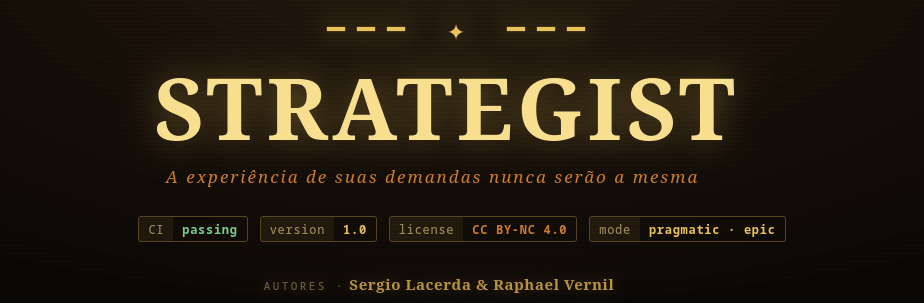

<!-- ╔══════════════════════════════════════════════════════════════╗
     ║  STRATEGIST · README estilo dungeon                            ║
     ║  Renderiza nativo no GitHub. Renomeie para readme.md e          ║
     ║  garanta que docs/banner.png esteja commitado no repositório.   ║
     ╚══════════════════════════════════════════════════════════════╝ -->

<p align="center">
  
</p>

<p align="center">
  
  
  
  
</p>

<p align="center">
  <i>Uma skill autônoma que <b>orquestra missões multi-fase</b> através de cinco papéis plugáveis.<br/>
  O Estrategista delega a cada câmara da masmorra e guarda o <b>portão de aprovação</b> — nunca empunha a lâmina por conta própria.</i>
</p>

---

## ⟡ Mapa da masmorra · pipeline da missão

```text
 [ WIZARD ] ──summon──▶ [ ESTRATEGISTA ]
 mago/install        mestre · orquestra
                          │ delega
        ┌─────────────────┼──────────────────┐
        ▼                 ▼
  [ RANGER ] ───────▶ [ ARCHIVIST ] ──▶ ╔═ APPROVAL GATE ═╗
  discovery            refino · docs        ║ humano  aprova ║
                                            ╚════════╤═══════╝
                                                     ▼
                                               [ SNIPER ]
                                                execução
 └╌╌╌╌╌╌ learning loop · feedback não-bloqueante ╌╌╌╌╌╌┘
```

---

## ⟡ A party · cinco papéis

| | Papel | Classe | Função na missão |
|:--:|:--|:--|:--|
| ☉ | **Estrategista** | Mestre · Orquestrador | Conduz a missão de ponta a ponta. Seleciona o conhecimento por `task_type`, delega a cada slot e guarda o approval gate. **Decide tudo; executa nada.** |
| ✶ | **Wizard** | Invocador · Instalador | Conjura o harness no repositório-alvo via `curl` / `irm`. Roda o wizard de configuração e sela os arcanos em `.strategist/`. |
| ⌖ | **Ranger** | Batedor · Discovery | Explora o terreno antes da batalha: levanta requisitos, mapeia o contexto e devolve um relatório de discovery limpo ao mestre. |
| ❒ | **Archivist** | Arquivista · Refino & Docs | Refina os achados do Ranger em especificação acionável e inscreve cada decisão em `.analysis/` — a crônica viva da missão. |
| ✜ | **Sniper** | Executor · Implementação | Só dispara **após a aprovação humana**. Executa a implementação refinada com precisão cirúrgica — um tiro, um commit. |

---

## ⛨ Approval Gate · regra inviolável

> [!IMPORTANT]
> **REQUER :: confirmação humana · sem exceções · sem auto-merge**
>
> Discovery e refino correm em fluxo livre, mas a câmara de execução permanece **trancada**.
> O Estrategista **nunca** invoca o Sniper sem aprovação humana explícita — a porta só abre pela sua mão.

---

## ⟡ O feitiço de invocação

**Linux / macOS / WSL**
```bash
curl -fsSL https://raw.githubusercontent.com/SergioLacerda/strategist-skill/main/bootstrap.sh | bash
```

**Windows PowerShell**
```powershell
irm https://raw.githubusercontent.com/SergioLacerda/strategist-skill/main/bootstrap.ps1 | iex
```

**Instalação local (sem curl)**
```bash
bash strategist/install.sh            # silent: defaults pragmatic-standalone
bash strategist/install.sh --wizard   # wizard interativo
```

Onde ficam os arquivos após a instalação:

| Arquivo | Função |
|:--|:--|
| `.strategist/active.yaml` | Modo (pragmatic/epic), base_path, roles |
| `.strategist/roles/default.yaml` | Slot providers: Ranger, Archivist, Sniper |
| `.strategist/knowledge.index.yaml` | Fontes de conhecimento por task_type |
| `.analysis/` | Artefatos de missão (pending, refined, done) |

---

## ⟡ Capacidades-chave

- **Slots plugáveis** — Ranger (discovery), Archivist (refino) e Sniper (execução) são providers configuráveis; o Estrategista delega, nunca executa diretamente.
- **Approval Gate obrigatório** — nunca invoca o Sniper sem aprovação humana explícita.
- **Dois modos** — `pragmatic` (tom analítico) e `epic` (tom estratégico); mesmo pipeline, vocabulário diferente.
- **Knowledge Index** — contexto seletivo por `task_type` antes de cada missão.
- **Learning Loop não-bloqueante** — registra outcomes com aprovação humana; falha nunca bloqueia o resultado.
- **Integração SDD opcional** — registrável como plugin, sem alterar o pipeline.

---

## ⟡ Documentação

| Documento | Descrição |
|:--|:--|
| [`readme_detailed.md`](readme_detailed.md) | Documentação técnica completa: pipeline, slots, personas, knowledge system, SDD |
| [`strategist/SKILL.md`](strategist/SKILL.md) | Instruções completas do agente |
| [`strategist/protocol.md`](strategist/protocol.md) | Regras de roteamento obrigatórias e stop conditions |
| [`strategist/skill.yaml`](strategist/skill.yaml) | Contrato da skill (slots, pipeline, forbidden_behaviors) |

---

<p align="center">
  ✦ <b>strategist-skill</b> ✦ standalone ✦
</p>
