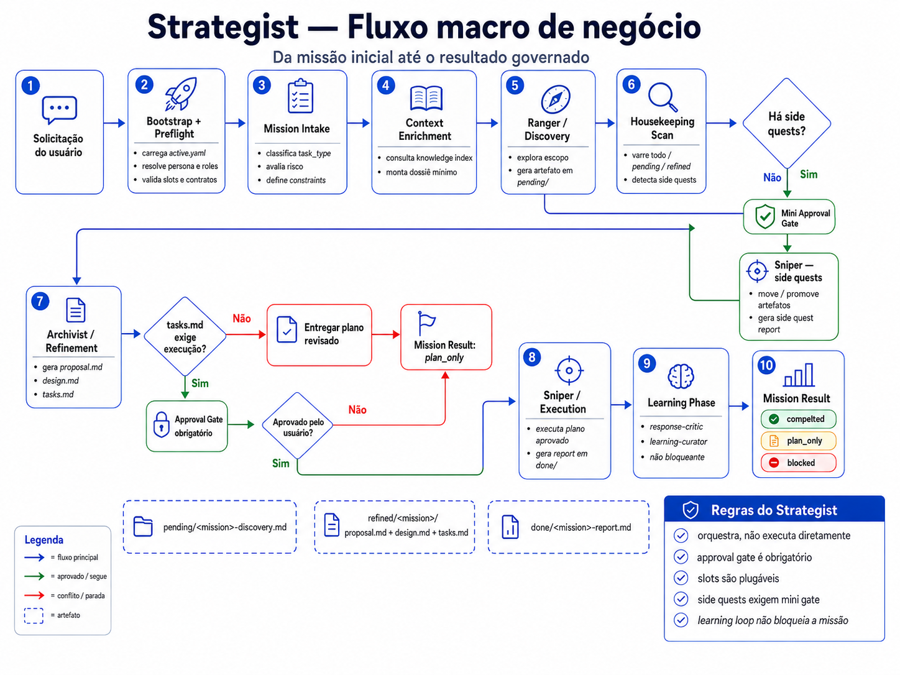
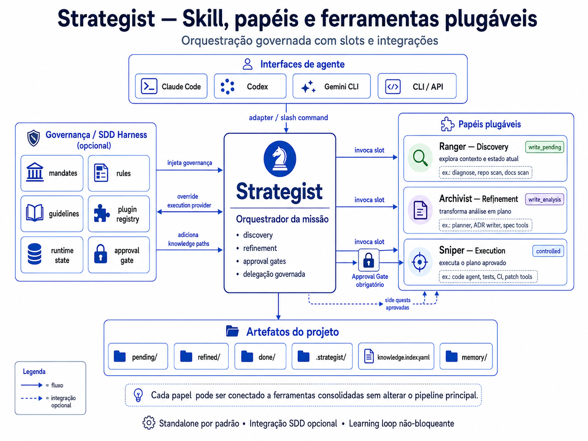

# Strategist Skill + SDD Harness


**Strategist** é uma skill autônoma que orquestra missões multi-fase através de três slots plugáveis — **Scout → Engineer → Hunter** — dentro de um fluxo governado com approval gate obrigatório. Standalone por padrão; integração opcional com o **SDD Harness**.

---

### Key Capabilities

- **Slots plugáveis** – Scout (discovery), Engineer (refinement) e Hunter (execution) são providers configuráveis; o Strategist delega, nunca executa diretamente.
- **Approval Gate obrigatório** – nunca invoca o Hunter sem aprovação humana explícita.
- **Dois modos de operação** – `pragmatic` (tom analítico) e `epic` (tom estratégico); mesmo pipeline, vocabulário diferente.
- **Knowledge Index** – contexto seletivo por `task_type` antes de cada missão; prioridades ajustadas por learning loop.
- **Learning Loop não-bloqueante** – registra outcomes e source-hints com aprovação humana; falha nunca bloqueia o resultado da missão.
- **Integração SDD opcional** – registrável como plugin; SDD injeta base_path, execution_provider e knowledge_paths sem alterar o pipeline.

---

### Instalação

```bash
# silent: defaults pragmatic-standalone
sh install.sh

# wizard interativo (TUI)
sh install.sh --wizard

# repositório alvo customizado
sh install.sh --target /path/to/repo
```

---

### Fluxo Geral



---

### Fluxo de Integração SDD



---

### Documentação

| Documento | Descrição |
|-----------|-----------|
| [readme_detailed.md](readme_detailed.md) | Documentação técnica completa: pipeline, slots, personas, knowledge system, SDD integration, forbidden behaviors |
| [strategist/SKILL.md](strategist/SKILL.md) | Instruções completas do agente |
| [strategist/protocol.md](strategist/protocol.md) | Regras de roteamento obrigatórias e stop conditions |
| [strategist/skill.yaml](strategist/skill.yaml) | Contrato da skill (slots, pipeline, forbidden_behaviors) |
| [strategist-mission-pipeline/design.md](strategist-mission-pipeline/design.md) | Decisões de design e rationale da implementação |
