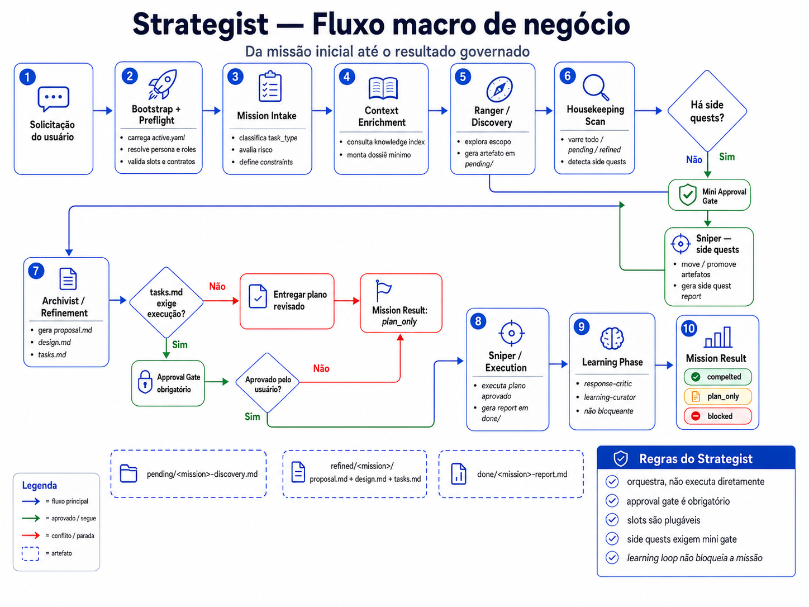
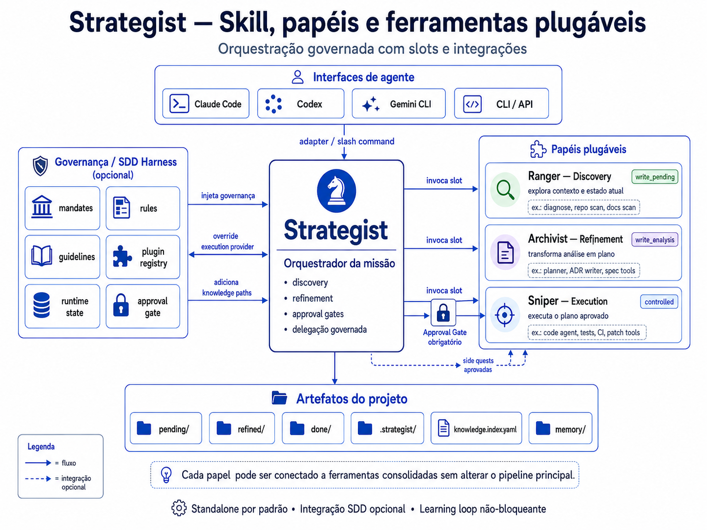

<p align="center">
  
</p>

<div align="center">


**Autores** · Sergio Lacerda &amp; Raphael Vernil

<br/>

<a href="https://sergiolacerda.github.io/strategist-skill/"></a>

<a href="readme.md"></a><a href="README.en.md"></a> &nbsp; <a href="#quick-workflow"></a>

━━━━━━━━━━━━━━━━━━━━ ⟡ ━━━━━━━━━━━━━━━━━━━━

</div>

<p align="center">
  <i>Uma skill autônoma que <b>orquestra missões multi-fase</b> através de três papéis plugáveis.<br/>
  O Estrategista orquestra a missão, confiando cada etapa a um especialista e aguarda no <b>portão de aprovação</b>.</i>
</p>

---

# Strategist Skill

## O que é

**Strategist** transforma uma solicitação técnica em missão governada: descoberta, refinamento e execução só com aprovação humana.

Pipeline canônico:
`Ranger → Archivist → approval gate → Sniper`

Para detalhes completos de pipeline, contratos e schemas: [readme_detailed.md](readme_detailed.md).

## Por que usar

- Discovery e refinement antes de execução.
- Approval gate obrigatório para escrita/implementação.
- Slots plugáveis (`discovery`, `refinement`, `execution`).
- Política de missão por `mission_mode` (análise vs entrega).
- Quick Draw, Opportunist Attack e Treasure Chests no mesmo fluxo.

## Como funciona

- **Ranger**: explora o contexto e gera discovery.
- **Archivist**: transforma em proposta, design e tasks.
- **Sniper**: executa somente após gate + política.
- **Opportunist Attack**: encontra side quests sem abrir pipeline paralelo.
- **Treasure Chests**: fontes offline de contexto por escopo.

## Instalação rápida

Linux / macOS / WSL:

```bash
curl -fsSL https://raw.githubusercontent.com/SergioLacerda/strategist-skill/main/bootstrap.sh | bash
```

Versão fixada (recomendado para ambientes sensíveis):

```bash
curl -fsSL https://raw.githubusercontent.com/SergioLacerda/strategist-skill/main/bootstrap.sh \
  | bash -s -- --version=v1.0.0
```

Reconfigurar:

```bash
strategist install --wizard
```

## Arquivos gerados

| Caminho | Função |
|---|---|
| `.strategist/active.yaml` | modo, idioma, slots, policy da missão |
| `.strategist/knowledge.index.yaml` | fontes por `task_type` |
| `.analysis/` | artefatos `pending`, `refined`, `done` |

## Configuração mínima de slots

```yaml
slots:
  discovery: brainstorming
  refinement: openspec-explore
  execution: sdd-ask
```

Contratos esperados:
- Ranger: `write_pending`
- Archivist: `write_analysis`
- Sniper: `controlled`

## Fluxo Geral



## Fluxo de Integração SDD



## Explore mais

- [readme_detailed.md](readme_detailed.md)
- [docs/configuration.md](docs/configuration.md)
- [docs/cli-reference.md](docs/cli-reference.md)
- [docs/architecture.md](docs/architecture.md)
- [docs/skill-internals.md](docs/skill-internals.md)
- [docs/c4-diagrams.md](docs/c4-diagrams.md)
- [docs/adr/](docs/adr/)
- [strategist/SKILL.md](strategist/SKILL.md)
- [strategist/protocol.md](strategist/protocol.md)

## Desenvolvimento e testes

```bash
make build
make test
make cover
```

## Licença

CC BY-NC 4.0. Uso comercial requer autorização prévia.

- Repositório: <https://github.com/SergioLacerda/strategist-skill>
- Documentação: <https://sergiolacerda.github.io/strategist-skill/index.html?lang=pt>
- Texto completo: [LICENSE](LICENSE)
