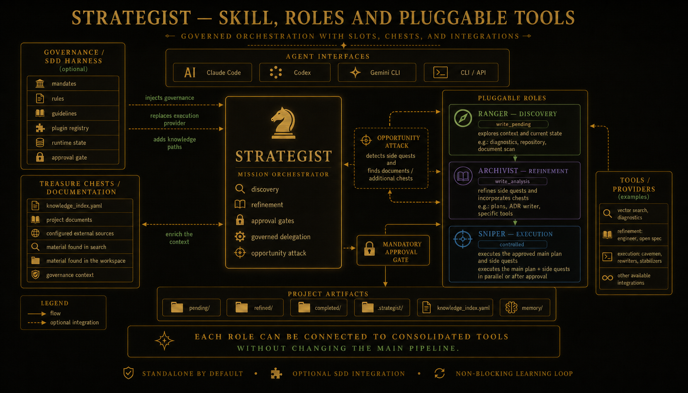
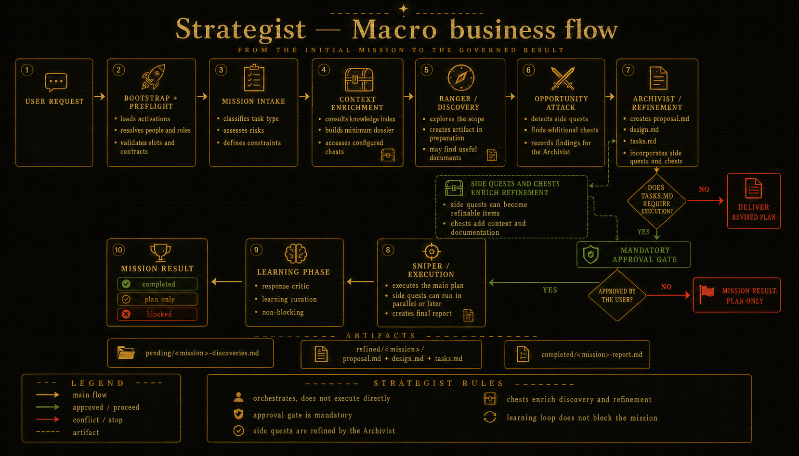

<p align="center">
  
</p>

<p align="center">
  <a href="https://sergiolacerda.github.io/strategist-skill/">
    
  </a>
</p>

<p align="center">
  
  
  
  
</p>

<p align="center">
<a href="readme.md">🇧🇷 Português</a> | 🇺🇸 English
</p>

---

# Strategist Skill + SDD Harness

**Strategist** is an autonomous skill that explores, analyzes, refines technical tasks and executes them, documenting every step. To do so, it orchestrates "missions" through pluggable roles (slots) — **Ranger (or discover) → Archivist (or refinement) → Sniper (or executor agent)** — within a governed flow with a mandatory approval gate. Standalone by default.

For the detailed pipeline, phases, schemas, and provider configuration: [readme_detailed_en.md](readme_detailed_en.md).

---

### Key Capabilities

- **Pluggable slots** – Ranger (discovery), Archivist (refinement), and Sniper (execution) are configurable providers;
- **Mandatory approval gate** – never implements changes without explicit human approval.
- **Two operating modes** – `pragmatic` (analytical tone) and `epic` (strategic tone); same pipeline, different vocabulary.
- **Knowledge index** – selective context by `task_type` before each mission; priorities adjusted by learning loop.
- **Non-blocking learning loop** – records outcomes and source-hints with human approval; failure never blocks the mission result.
- **Optional SDD integration** – The skill submits to governance, registerable as a plugin, adhering to mandates, rules, and guidelines defined externally to the plugin.

---

### Side Quests · Opportunity Attack

Before the main analysis, Strategist scans the workspace detecting inconsistent artifacts. The result is passed to the Archivist as context — side quest execution happens when the Sniper is released by the main gate (alongside the main mission).

| Phase | Function |
|-------|----------|
| **Housekeeping Scan** _(Opportunity Attack)_ | Detects stale artifacts in `todo/`, `pending/`, `refined/` and assembles a side quest manifest. |
| **Side Quest** | Small missions executed by the Sniper after approval at the main gate — move completed tasks, promote artifacts, targeted hotfixes. |

> Full pipeline: `Ranger → housekeeping_scan → Archivist → approval gate → Sniper(side quests + main)`

---

### General Flow



---

### SDD Integration Flow



---

### Documentation

| Document | Description |
|----------|-------------|
| [readme_detailed_en.md](readme_detailed_en.md) | Complete technical documentation: pipeline, slots, personas, knowledge system, SDD integration, forbidden behaviors |
| [docs/architecture.md](docs/architecture.md) | Go architecture: package map, installation flow, compilation pipeline, domain interfaces |
| [docs/cli-reference.md](docs/cli-reference.md) | Reference for all CLI commands with flags and examples |
| [docs/configuration.md](docs/configuration.md) | Complete schemas: active.yaml, roles, personas, knowledge index |
| [docs/skill-internals.md](docs/skill-internals.md) | Sub-skills, phase contracts, intake/progress schemas, write scopes |
| [docs/c4-diagrams.md](docs/c4-diagrams.md) | C4 diagrams: context, containers, Go components, and runtime pipeline |
| [docs/adr/](docs/adr/) | Architecture Decision Records: 5 fundamental project decisions |
| [strategist/SKILL.md](strategist/SKILL.md) | Complete agent instructions |
| [strategist/protocol.md](strategist/protocol.md) | Mandatory routing rules and stop conditions |
| [strategist/skill.yaml](strategist/skill.yaml) | Skill contract (slots, pipeline, forbidden_behaviors) |

---

### Quick Workflow

**Linux / Mac / WSL — install (wizard by default):**
```bash
curl -fsSL https://raw.githubusercontent.com/SergioLacerda/strategist-skill/main/bootstrap.sh | bash
```

> The bootstrap downloads the `strategist` binary, verifies the SHA256, and runs `strategist install`. No external dependencies (no jq, yq, python3).

> **Security risk — piping curl directly:** running `curl | bash` without specifying a version installs the latest version from the `main` branch, with no integrity guarantee. A supply chain attack or MITM could replace the script in transit. **In production environments, always use a pinned version:**
```bash
curl -fsSL https://raw.githubusercontent.com/SergioLacerda/strategist-skill/main/bootstrap.sh \
  | bash -s -- --version=v1.0.0
```
> The pinned version downloads the binary from a tagged GitHub release and verifies the SHA256 before installing. Direct piping without `--version` is acceptable in ephemeral environments (CI, dev containers), but not on shared machines or those with privileged access.

**Update configuration (re-run wizard):**
```bash
strategist install --wizard
```

---

**Where files are stored after installation:**

| File | Function |
|------|----------|
| `.strategist/active.yaml` | Mode, base_path, slots, language, adr_enabled |
| `.strategist/knowledge.index.yaml` | Knowledge sources by task_type |
| `.analysis/` | Mission artifacts (pending, refined, done) |

---

**Configuring the roles (slots):**

Each mission role is a pluggable skill. Providers are set directly in `active.yaml`, under the `slots` key:

```yaml
# .strategist/active.yaml
slots:
  discovery: brainstorming      # Ranger  — explores and documents the problem
  refinement: openspec-explore  # Archivist — refines and structures the plan
  execution: sdd-ask            # Sniper  — executes the approved plan
```

To swap a provider, edit `active.yaml` and point to any skill available in your environment. The preflight validates the contracts (`risk_score`) before starting the mission.

**Available providers per slot:**

| Slot | Required contract | Tested providers |
|------|-------------------|-----------------|
| Ranger (discovery) | `write_pending` | `brainstorming` |
| Archivist (refinement) | `write_analysis` | `openspec-explore`, `openspec-propose`, `archivist`, `sdd-diagnose`, `sdd-review-architecture` |
| Sniper (execution) | `controlled` | `sdd-ask`, `sdd-ask-full`, `openspec-apply-change`, `sdd-converge`, `sdd-correct` |

New providers can be registered in `.strategist/templates/known-providers.yaml` if they do not declare `risk_score` in their own `skill.yaml`.

---

### Local Installation (build from source)

To contribute or use the latest version from the repository without waiting for a release:

```bash
# 1. Compile the binary (embeds the current strategist/ defaults into the binary)
make build          # → bin/strategist

# 2. Install to PATH
make install-local  # → ~/.local/bin/strategist

# 3. Ensure ~/.local/bin is in PATH (add to .bashrc/.zshrc if needed)
export PATH="$HOME/.local/bin:$PATH"

# 4. Install the skill in the current repository
strategist install --wizard
```

> **Why `make build` before `install`?** The binary embeds files from `strategist/` at compile time (`embed.FS`). Without a rebuild, `strategist install` installs the defaults from the previous binary version, not from the local repository.

> The Quick Workflow (`curl | bash`) does not need this step — the bootstrap downloads a pre-compiled binary from the GitHub release.

---

## 🧪 Tests

### Prerequisites

```bash
# Go 1.26+
go version

# Install dependencies
go mod tidy
```

No jq, yq, or pyyaml. The test suite uses only `go test`.

---

### Running Tests

```bash
# All tests (with race detector)
go test -race ./...

# Or via Makefile
make test

# With coverage report
make cover
```

---

### Suites

| Suite | File | Covers |
|-------|------|--------|
| Stale checker | `tests/stale_test.go` | 5 cases: absent, no manifest, fresh, stale source, source gone |
| Compile | `tests/compile_test.go` | Config, Domain, Index, All (4 artifacts + manifest) |
| Install | `tests/install_test.go` · `internal/install/installer_whitebox_test.go` | Silent mode, gitignore, whitebox (ensureGitignore, error propagation) |
| Fixtures | `tests/fixtures_test.go` | Format of the 5 security invariant fixtures |

---

### BDD Specs

`strategist/tests/specs/*.feature` — formal specifications of security invariants (approval gate, slot contracts, forbidden behaviors, LearningBuffer). Executable documentation — no separate runner required.

---

## 📄 License

This project is licensed under the **Creative Commons Attribution-NonCommercial 4.0 International (CC BY-NC 4.0)**.

You may use, study, modify, and replicate this project for non-commercial purposes, provided that attribution to the original author is preserved.
Commercial use, resale, or commercialization requires prior written authorization from the copyright holder.

- **Repository:** <https://github.com/SergioLacerda/strategist-skill>
- **Documentation (GitHub Pages):** <https://sergiolacerda.github.io/strategist-skill/>
- **Full license text:** [`LICENSE`](LICENSE)
