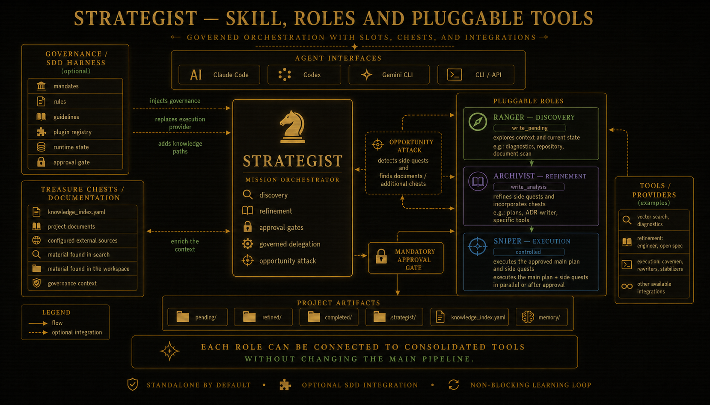

<div align="center">

<br/>


<br/>
<br/>

### ────── ✦ ──────

# STRATEGIST
### *Your experience with your demands will never be the same.*

<p>
  An autonomous skill that <strong>orchestrates multi-phase missions</strong><br/>
  through pluggable roles, context chests, and approval gates.
</p>

### ────── ⟡ ──────

<p align="center">
  <sub>
    🇧🇷 <a href="./readme.md"><code>Português</code></a>
    &nbsp;│&nbsp;
    🇺🇸 <strong><code>English</code></strong>
  </sub>
</p>

<a href="https://sergiolacerda.github.io/strategist-skill/index.html?lang=en">
  
</a>

<br/>

<p><strong>Authors</strong> · Sergio Lacerda & Raphael Vernil</p>
</div>

---

# Strategist Skill

## What it is

**Strategist** turns a technical request into a governed mission: discovery, refinement, and execution only with explicit human approval.

Canonical pipeline:
`Ranger → Archivist → approval gate → Sniper`

For full pipeline/contracts/schema details: [readme_detailed_en.md](readme_detailed_en.md).

## Why use it

- Discovery and refinement before execution.
- Mandatory approval gate for writes/implementation.
- Pluggable slots (`discovery`, `refinement`, `execution`).
- Mission policy through `mission_mode` (analysis vs delivery).
- Quick Draw, Opportunist Attack, and Treasure Chests in the same flow.

## How it works

- **Ranger**: explores context and produces discovery.
- **Archivist**: turns discovery into proposal, design, and tasks.
- **Sniper**: executes only after gate + policy checks.
- **Opportunist Attack**: finds side quests without parallel pipelines.
- **Treasure Chests**: offline scoped context sources.

## Quick install

Linux / macOS / WSL:

```bash
curl -fsSL https://raw.githubusercontent.com/SergioLacerda/strategist-skill/main/bootstrap.sh | bash
```

Pinned version (recommended for sensitive environments):

```bash
curl -fsSL https://raw.githubusercontent.com/SergioLacerda/strategist-skill/main/bootstrap.sh \
  | bash -s -- --version=v1.0.0
```

Reconfigure:

```bash
strategist install --wizard
```

## Generated files

| Path | Purpose |
|---|---|
| `.strategist/active.yaml` | mode, language, slots, mission policy |
| `.strategist/knowledge.index.yaml` | sources by `task_type` |
| `.analysis/` | `pending`, `refined`, `done` artifacts |

## Minimal slot configuration

```yaml
slots:
  discovery: brainstorming
  refinement: openspec-explore
  execution: sdd-ask
```

Expected contracts:
- Ranger: `write_pending`
- Archivist: `write_analysis`
- Sniper: `controlled`

## General Flow



## SDD Integration Flow


## Explore more

- [readme_detailed_en.md](readme_detailed_en.md)
- [docs/configuration.md](docs/configuration.md)
- [docs/cli-reference.md](docs/cli-reference.md)
- [docs/architecture.md](docs/architecture.md)
- [docs/skill-internals.md](docs/skill-internals.md)
- [docs/c4-diagrams.md](docs/c4-diagrams.md)
- [docs/adr/](docs/adr/)
- [strategist/SKILL.md](strategist/SKILL.md)
- [strategist/protocol.md](strategist/protocol.md)

## Development and tests

```bash
make build
make test
make cover
```

## License

CC BY-NC 4.0. Commercial use requires prior authorization.

- Repository: <https://github.com/SergioLacerda/strategist-skill>
- Documentation: <https://sergiolacerda.github.io/strategist-skill/index.html?lang=en>
- Full text: [LICENSE](LICENSE)
